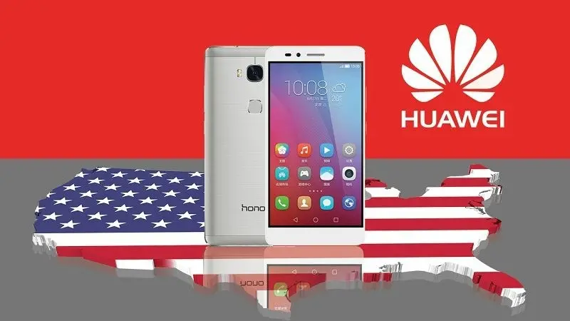
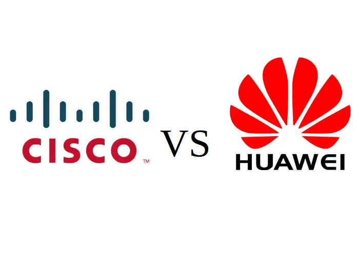

Почему США не успокоятся, пока не уничтожат Huawei окончательно — полная хронология событий с 2003 года
====

Как Соединённые Штаты объявили «войну на истребление» одному из самых популярных производителей смартфонов в мире
Сначала Google подготовят официальный комментарий, а потом Huawei сформулируют официальный комментарий в ответ на официальный комментарий Гугла. Если вы вдруг думаете, что по итогам этой первой возни кто-то вспомнит, как долго продолжается этот «бокс по переписке», зря надеетесь. А вот мы кое-что знаем и расскажем, с чего всё началось и к чему движется.
Сначала Google подготовят официальный комментарий, а потом Huawei сформулируют официальный комментарий в ответ на официальный комментарий Гугла. Если вы вдруг думаете, что по итогам этой первой возни кто-то вспомнит, как долго продолжается этот «бокс по переписке», зря надеетесь. А вот мы кое-что знаем и расскажем, с чего всё началось и к чему движется.

Оглавление
----------

- [Сначала сетевое оборудование для операторов](#Сначала_сетевое_оборудование_для_операторов)
- [Запрет на продажу оборудования армии, запрет на сотрудничество с американскими компаниями](#Запрет_на_продажу_оборудования_армии,_запрет_на_сотрудничество_с_американскими_компаниями)
- [Первоначальный запрет на продажу телефонов на территории США](#Первоначальный_запрет_на_продажу_телефонов_на_территории_США)
- [Охота на сотрудников Huawei в дружественных странах](#Охота_на_сотрудников_Huawei_в_дружественных_странах)
- [Запрет на использование Android, чтобы перекрыть прибыль от продаж телефонов и планшетов](#Запрет_на_использование_Android,_чтобы_перекрыть_прибыль_от_продаж_телефонов_и_планшетов)

Сначала сетевое оборудование для операторов
-------------------------------------------

Сейчас отовсюду выползут эксперты и будут рассказывать, мол «ох уж этот непредсказуемый Трамп, все беды из-за него!», но на самом деле Huawei стоит «поперёк горла» американскому бизнесу и государству уже давно.

Первыми засуетились коммерсанты -- ещё **16 лет назад, в 2003 году**, в период президентства Джорджа Буша, американская телекоммуникационная компания Cisco [обвинила](https://www.osp.ru/nets/2003/03/148445/) Huawei в воровстве технологий и нарушении патентов. По итогам этого разбирательства Huawei признала (!) вину и пообещала внести изменения в свою продукцию (для операторов проводного интернета, магистральных операторов, которые тянут вам «интернеты» через границы, роутеры и вышки сотовых операторов). После этого о скандале быстро забыли -- рэкет друг друга патентами в США к тому времени был национальным видом спорта и основным кормом для армии местных юристов, и ещё один конфликт из тысяч подобных ничем не выделялся.

Затем **в 2004 г.** сотрудника Huawei внезапно поймали на выставке электроники с поддельным бейджиком посетителя в момент, когда он разобрал новую выставочную модель конкурента-создателя «штуковин для операторов связи» и увлечённо фотографировал микросхемы новинки. Huawei в ответ на это пожали плечами, сказали «компания у нас большая, мало ли какие альтернативно одарённые затесались -- уволим наглеца. А мы к этой ситуации непричастны».

Запрет на продажу оборудования армии, запрет на сотрудничество с американскими компаниями
-----------------------------------------------------------------------------------------

Прошло ещё четыре года, и вот **в 2008 году** американские военные докладывают Бушу, что Huawei и ZTE тайно сотрудничают с китайским правительством и министерством обороны, при этом пересылают руководителям КНР всё, что получается «вынюхать» из коммутаторов и прочего добра, по которому «бегают интернеты» простых граждан. Перво-наперво продукцию Huawei и ZTE запретили использовать в любых, даже не секретных государственных и военных учреждениях, а после этого запретили этим компаниям поглощать любые американские компании. Вряд ли это был акт американского национализма или боязнь Китая, потому что Lenovo, как вы помните, без проблем дважды выкупал активы крупных американских корпораций -- сначала подразделение по выпуску компьютеров и ноутбуков у IBM, а потом -- Моторолу (то, что от неё осталось) у Google. Все политиканы и военные наблюдали за этим процессом и абсолютно не возражали.

Болтун - находка для шпиона. По мнению США - в особенности, если болтаешь по смартфону Huawei
Первоначальный запрет на продажу телефонов на территории США

С 2008 года утекло много воды, Huawei из создателя узкоспециализированной всячины для операторов превратился в производителя качественных и разумных по цене телефонов. И не только создавал их для себя любимого, но и был готов выпускать модели на заказ. В то время в подобных заказах нуждался Google – гугловцы тогда ещё были адекватными и не лепили сомнительных конкурентов Айфону, как это сейчас происходит с Google Pixel, а выпускали дешёвые флагманы Nexus. Как правило подрядчиками по выпуску таких телефонов были LG и HTC, но к 2015 году с «ХТЦ» договориться не получилось и Google впервые предложил денег и славы китайцам.

Huawei с радостью согласился, принял от Гугла инструкции «хочу примерно вот с таким экраном, такими динамиками, такой-то камерой и чтоб работал столько» и создал неплохой Huawei/Google Nexus 6P.

Причём Хуавей делал это не столько ради денег, сколько ради славы – в Китае и России смартфоны Huawei и Honor уже были хорошо известны, а вот у американцев всегда была «своя атмосфера». Точнее, непаханное поле, на котором резвились не только популярные во всём мире Apple iPhone и Samsung, но и «недобитая» Motorola или уже никому не нужный в Европе/Китае/России LG. Huawei понимали, что от пирога платежеспособных и «непуганных» этими вашими Xiaomi/Meizu покупателей можно откусить хороший куш, если получится сделать так, чтобы хуавеевские смартфоны хотя бы начали продавать в магазинах.

Хороший был смартфон. Но даже Google не смог заставить американских операторов взять его в продажу

У американцев «начали продавать» = «договориться с операторами сотовой связи, чтобы смартфон включали со скидкой в комплект с контрактом на сотовую связь». Потому что в США телефоны покупают не в магазинах, а у операторов – таким образом операторы продают мобильники дёшево, и вы получаете дешёвый смартфон + дорогую сотовую связь. Если покупаете в обычном магазине, получаете дорогой смартфон + дорогую сотовую связь. Выбор очевиден.

Так вот – с выпуском «фирменного гугловского» Nexus 6P китайцы надеялись, что Google приложит усилия и сможет протолкнуть новинку в руки операторам. А там уж пойдут продажи, народ узнает, что Huawei делает хорошие вещи, радостные операторы постучатся к Хуавею с контрактами на новые модели смартфонов, и всё как закрут~

Но не сложилось – Google обещание не сдержал, смартфоны Nexus 6P у операторов не появились, поэтому, когда гугловцы прибежали к Huawei с просьбой «а давайте попробуем ещё раз, но уже со смартфонами Pixel!», китайцы послали его в известном направлении. И решили, что Google – тот ещё козёл и сам виноват в том, что почти все производители отказываются лепить для него смартфоны на заказ.

Только вот Google был не виноват, и Huawei почувствовали это на своей собственной шкуре, когда спустя три года попытались начать продажи смартфонов своими силами, на личных договорённостях с операторами.

В 2018 году Huawei уже входил в тройку крупнейших и популярнейших производителей смартфонов в мире, и американские операторы понимали, что с новым, качественным, но более сговорчивым в распределении прибыли, чем Apple и Samsung, партнёром можно горы свернуть. Да и смартфон был подходящий – Huawei Mate 10 Pro. Он, на минуточку, фотографировал лучше, чем самые крутые на тот момент Samsung Galaxy Note8 и Apple iPhone 8 Plus.

С операторами договорились, подготовили совместную конференцию с речами «наконец-то мы начинаем продавать смартфоны в США! А вот и наши друзья из сотовых операторов скажут, как и по какой цене начнутся продажи!». Но… американские операторы в последний момент «слились» и сказали «извините, ребята, мы тут чё-то передумали – теперь уже не хотим продавать ваши смартфоны».

Американские операторы очень-очень хотели начать продавать Huawei Mate 10 Pro. А потом в последний момент все вместе взяли и перехотели. С кем не бывает?

Если вы думаете, что приёмы «кто не понял – тот поймёт» использует только Рамзан Кадыров, вы ошибаетесь – в США тоже позвонили, откуда нужно, после чего сотовые операторы перехотели зарабатывать сверхприбыли и соблюдать договорённости, которые сами накануне подписали.
Охота на сотрудников Huawei в дружественных странах

И вот тут бы Хуавею напрячься и сделать выводы, но китайцы рассудили «чёрт с ними, с американцами – будем продавать у них то, что можно продавать, а на смартфонах заработаем как-нибудь в остальном мире!».

Но американцы уже не собирались останавливаться, и не помогло даже то, что хуавеевцы не совались на территорию США – меньше, чем через год, в конце 2018 года они поймали момент, когда финансовый директор Huawei, Мэн Ваньчжоу, находилась в дружественной Канаде, попросили друзей «привезти нам вот эту вот, поговорить хотим». После чего канадцы арестовали девушку и отправили её на допрос в Штаты, где ей предъявили «мы тут наложили санкции на Иран, а вы ему продаёте свои сотовые вышки и электронику – готовьтесь к наказанию за это!».

Канадские джентльмены сопровождают гражданку Китая на свидание с демократией

В итоге конфликт между Huawei и правительством США перерос в конфликт между правительством Китая и правительством США и продолжается до сих пор. А Трамп, пользуясь случаем, заявил, что США готовы снять обвинения с Мэн Ваньчжоу, если китайцы сделают уступки в торговых переговорах с Китаем. Если вы не знаете, к чему он клонит, напоминаем вам, что Китай и США сейчас взаимно внедряют пошлины на товары и вообще пытаются напакостить друг другу. И мы до сих пор не знаем, был ли Huawei настолько виноват, как ему это вменяют, либо просто оказался «разменной картой», которая подвернулась под руку в подходящее время.
Запрет на использование Android, чтобы перекрыть прибыль от продаж телефонов и планшетов

А вот теперь Хуавею, как мы уже знаем, запретили использовать Android в смартфонах и планшетах, «чтобы наверняка». К чему это приведёт, во что выльется дальше и как Huawei будет выкручиваться, мы поговорим во второй части нашей статьи.

[Source](https://www.ferra.ru/review/mobile/huawei-vs-us-trade-war-history.htm?ref=tjournal.ru)
