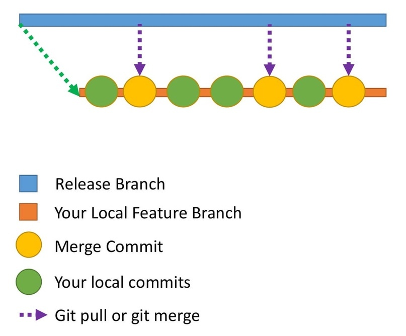
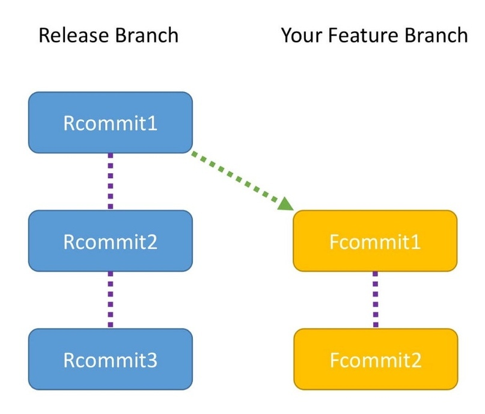
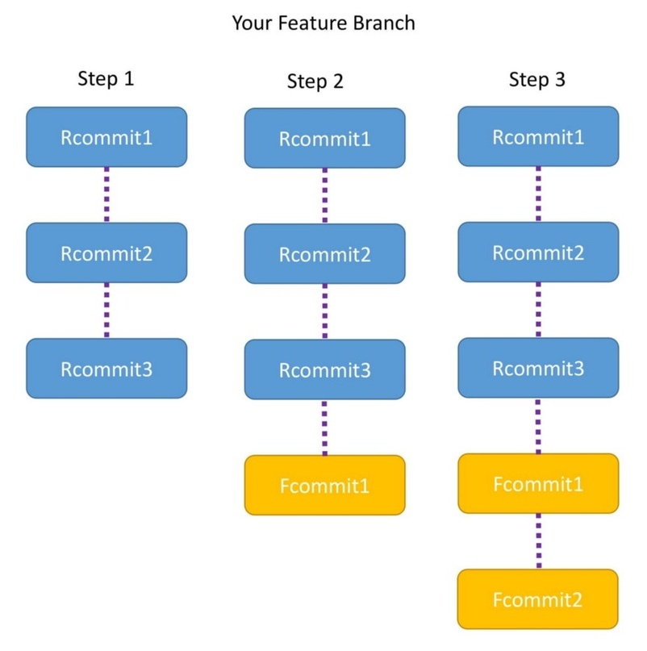

Как улучшить свой опыт работы с Git
===================================

Я сделал ошибку в своем коммите, как это исправить?

Моя история коммитов это полный бардак, как сделать ее аккуратнее?

Если вы когда-либо задавались подобными вопросами, этот пост для вас. В нем освещается список тем, знание которых позволит вам улучшить свой опыт работы с Git.

Помните: чтобы получить наибольшую пользу от этой статьи, для начала вам нужно освоить основы Git.

Я сделал ошибку в своем коммите. Что делать?
--------------------------------------------

* Сценарий 1

Например, вы сделали коммит нескольких файлов и поняли, что введенное вами сообщение коммита не слишком понятное. Вы хотите его изменить. Чтобы это сделать, вам нужно использовать команду git commit —amend

    git commit --amend -m “Новое сообщение коммита”

* Сценарий 2.

Скажем, вы хотели сделать коммит 6 файлов, но по ошибке внесли только 5. Можно, конечно, создать новый коммит и добавить 6-й файл.

В этом подходе нет ничего плохого. Но чтобы ваша история коммитов была аккуратнее, будет лучше каким-то образом добавить этот файл к предыдущему коммиту. Это также можно сделать с помощью команды git commit —amend:

    git add file6git

    commit --amend --no-edit
—no-edit означает, что сообщение коммита не меняется.

* Сценарий 3

Когда бы вы ни сделали коммит в Git, к нему будет привязано имя автора и email. Вообще, эти данные указываются при первоначальной настройке Git. Об этих деталях не стоит волноваться при каждом коммите.

Но может так случиться, что в конкретном проекте вы захотите использовать другой email ID. Сконфигурировать email id для этого проекта можно следующей командой:

    git config user.email “ваш email id”

* Памятка

Используйте команду amend **только** в своем локальном репозитории. Использование amend для удаленного репозитория может создать много путаницы.

Моя история коммитов беспорядочна. Как с этим справиться?
---------------------------------------------------------

Допустим, вы работаете над куском кода. Вы знаете, что на завершение этого кода понадобится примерно 10 дней. В течение этих 10 дней другие разработчики также будут делать коммиты в удаленный репозиторий.

Хорошим подходом будет постоянно апдейтить ваш локальный репозиторий, чтобы код в нем соответствовал коду в удаленном. Это позволит вам избежать множества merge-конфликтов при подаче пул-реквеста в дальнейшем. Поэтому вы решаете забирать изменения из удаленного репозитория раз в два дня.

Каждый раз, когда вы забираете код из удаленного репозитория в локальный, в вашем локальном репозитории создается новый merge-коммит. Это означает, что в вашей локальной истории будет много merge-коммитов, а это может сбивать с толку того, кто затем будет ее просматривать.

*Как сделать историю коммитов аккуратнее? В этом вам поможет rebase.*

Что такое rebasing?

Объясню на примере.

1. В Release branch есть три коммита: Rcommit1, Rcommit2 и Rcommit3.
2. Вы создали ваш Feature branch из Release branch, когда в нем был только один коммит -- Rcommit1.
3. Вы добавили два коммита в Feature branch. Это Fcommit1 и Fcommit2.
4. Ваша цель -- получить коммиты из Release branch в ваш Feature branch.
5. Для этого вы собираетесь использовать rebase.
6. Давайте назовем Release branch словом release, а Feature branch -- словом feature.
7. Rebasing можно сделать с помощью следующих команд:

        git checkout featuregit rebase release

Rebasing
-----------

При выполнении rebasing ваша цель – обеспечить получение Feature branch последнего кода из Release branch.

Rebasing пытается добавить все коммиты один за другим и проверяет, нет ли конфликтов. Звучит запутанно?

Я поясню с помощью диаграммы. Здесь показано, что на самом деле осуществляет rebasing.

* Шаг 1

1. При запуске команды Feature branch направлен к head Release branch.
2. Теперь Feature branch содержит три коммита: Rcommit1, Rcommit2 и Rcommit3.
3. Вероятно, вам интересно, что случилось с Fcommit1 и Fcommit2.
4. Эти коммиты по-прежнему здесь; они будут использоваться в следующих шагах.

* Шаг 2

1. Теперь Git пытается добавить Fcommit1 в Feature branch.
2. Если конфликтов нет, Fcommit1 добавляется после Rcommit3.
3. Если есть конфликт, Git уведомит вас об этом и вам придется разрешить этот конфликт вручную.

* Шаг 3

1. Когда Fcommit1 будет добавлен, Git попытается добавить Fcommit2.
2. Опять же, если конфликтов не будет, Fcommit2 добавится после Fcommit1 и rebase пройдет успешно.
3. Если будет конфликт, Git уведомит вас об этом и вам придется разрешить этот конфликт вручную.
4. После полного окончания rebase вы заметите, что Feature branch содержит Rcommit1, Rcommit2, Rcommit3 , Fcommit1 и Fcommit2.

* Что стоит запомнить

* В Git полезен и Rebase, и Merge. Один ничем не лучше другого.
* В случае с merge у вас будет merge-коммит. В случае с rebase таких дополнительных коммитов не будет.
* Самый лучший подход -- использовать эти команды с различными целями. Выбирайте rebase для обновления своего локального репозитория в соответствии с последними изменениями на удаленном репозитории. Используйте merge при пул-реквестах, чтобы слить Feature branch обратно в Release или Master branch.

Поздравляю. Теперь вы Git-эксперт

Прочтя эту статью, вы узнали о внесении правок в коммиты и о rebase. Это очень важные темы, которые вам обязательно пригодятся.

*Перевод [статьи](https://www.freecodecamp.org/news/how-to-become-a-git-expert-e7c38bf54826/) Адити Сридхара «How to become a Git expert».*

*Источник: [techrocks](https://techrocks.ru/2018/10/10/how-to-improve-your-git-experience/)*

[Source](https://vk.com/@itcookies-kak-uluchshit-svoi-opyt-raboty-s-git)
