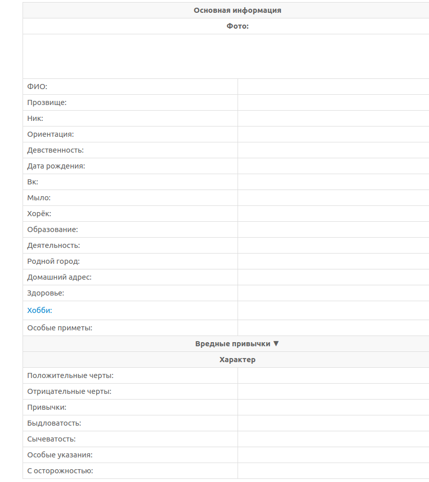
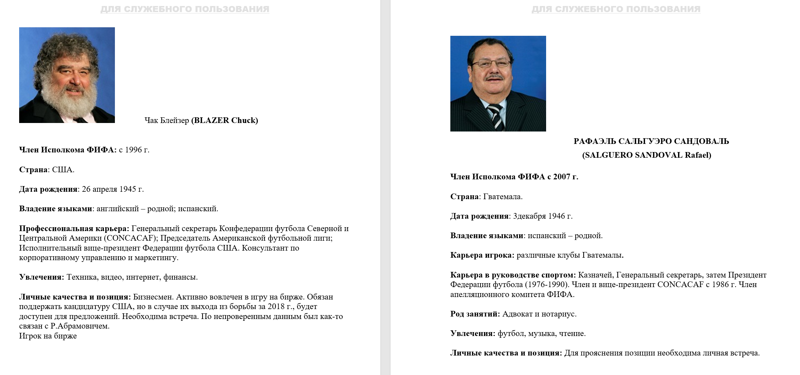
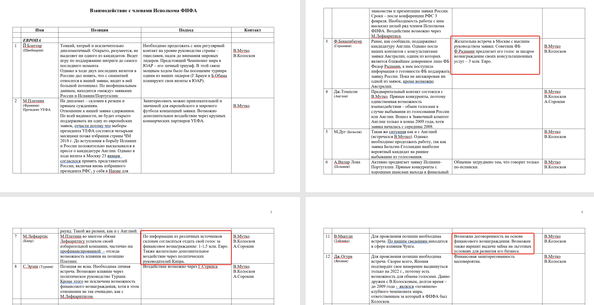
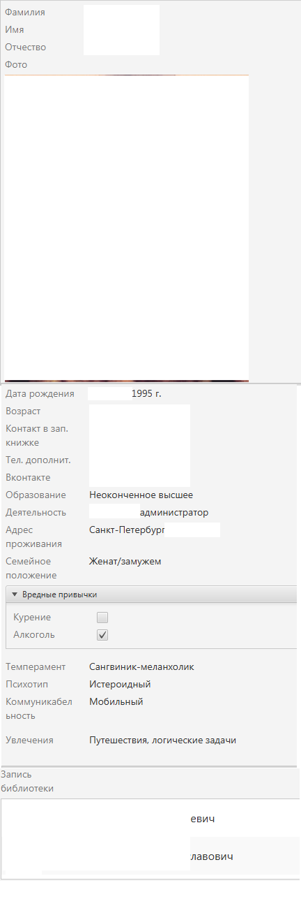

Досье
=====

Фарли-досье
-----------

[Фарли-досье](https://ru.wikipedia.org/wiki/%D0%A4%D0%B0%D1%80%D0%BB%D0%B8-%D0%B4%D0%BE%D1%81%D1%8C%D0%B5) представляет собой набор записей, хранимых политиками, на людей, с которыми они встречались ранее.

Термин назван по имени Джеймса Алоизиуса Фарли, бывшего менеджера предвыборной кампании Франклина Делано Рузвельта. Фарли, который впоследствии стал Генеральным Почтмейстером и председателем Демократического Национального комитета, составлял досье на всех, кого он когда-либо встречал, и кто когда-либо встречался с Рузвельтом. Когда планировалась ещё одна встреча этих людей с Рузвельтом, Фарли просматривал свои досье, подготавливая Рузвельта ко встрече так, что он помнил их супругов, имена и возраст их детей — все, что узнавалось из предыдущих встреч, а также других источников, то, что Фарли добавил в досье. Эффект получался мощный и вызывающий особое доверие.

Такие "Фарли-досье" сейчас обычно используют различные политики и бизнесмены.

Концепция занимает значимое место в романе Роберта Хайнлайна Двойная Звезда, в котором актёр перевоплощается в крупного политического деятеля. Он добивается наилучшего сходства даже при личных встречах за счет использования Фарли-досье политика.

Это имя также появляется в романе Майкла Крайтона Восходящее солнце, где персонаж по имени Эллен Фарли работает помощницей мэра и "она стоит сбоку от него и шепчет ему имя каждого человека".

Фарли-досье можно сравнить с древнеримским номенклатором, 'рабом, который сопровождал хозяина во время агитации и в похожих случаях, для того, чтобы подсказывать ему имена тех, кого тот встречал на улице.

Web-scrapers
------------

Шаблон 1
------

ОСНОВНАЯ ИНФОРМАЦИЯ
Фамилия, Имя,Отчество, Фото, Дата рождения, Возраст, Контакт в зап. книжке, Тел.дополнит., Вконтакте, Email, Образование, Деятельность, Адрес проживания, Семейное положение, Паспорт, Вредные привычки, Особые приметы

ПСИХОЛОГИЧЕСКИЙ ПОРТРЕТ: Темперамент, Психотип, Коммуникабельность

ИНТЕРЕСЫ: Увлечения, Хобби

ЗНАКОМСТВА: Список связанных людей

Про психотипы может глянуть [тут](https://rghost.net/7D2tMlDNl) , а про типы коммуникабельности - [тут](https://studopedia.ru/4_32491_osnovnie-tipi-kommunikabelnosti-lyudey.html).

Шаблон 2
--------

[В качестве БД можно использовать движок MediaWiki](https://2ch.hk/diy/src/446690/15309107175330.mp4)

Шаблон 3
--------

Шаблон 4
--------

Шаблон 5
--------

Инструменты:
------------

Microsoft Excel/Access, Libre Office Calc/Base. Лично я составляю досье в **Memento Database** - есть версия для Android и Windows, синхронизация с облаком от разработчиков и Google Docs, импорт и экспорт в csv, экспорт в pdf. Минус нашёл пока один - размер облака 50mb, так что вкладывать в профайл большие фотки возможности нет.

 В разделе "запись библиотеки" показываются знакомые этого человека (и соответственно ссылки на них).

* [Open Refine](https://openrefine.org/)

* [Tap Forms](https://www.tapforms.com/) - iOS

* [AirTable](https://airtable.com/) - Android

* [IBM SPSS](https://rutracker.org/forum/viewtopic.php?t=5820416)

> Аналитика делается так: собираем факты, не обдумывая. Записываем их с коэффициентами: "+", "-", "0". Положительный, отрицательный, нейтральный - по отношению к модели, которую строим. "Крым в составе России", "Устойчивость рубля", "Перспективы России на международной арене" и т.д. По возможности присваиваем им такие же коэффициенты достоверности. НЕ ОБДУМЫВАЕМ. Собранные и организованные материалы загоняем в SPSS. Получаем модель и вот тут начинаем думать. Все умозаключения до построения модели суть писание вилами на моче и ценности не имеют. Зато после можно определить, какие факторы реально "+", какие "-". Установить вектор - куда движется ситуация. Что можно (нужно) сделать, чтобы двигалась в желаемом направлении.
Нетрудно понять, что модель верна настолько, насколько хороши данные. Поскольку огромное их количество лживо, недостоверно и вообще в чьих-то интересах, надо (обязательно!) собирать противоположные данные. В итоге бОльшая их часть взаимно нейтрализуется, но с тем, что остаётся, можно работать. [ru-board](http://forum.ru-board.com/topic.cgi?forum=35&topic=3719&start=1060). Альтернатива [PSPP (типа бесплатный аналог)](https://www.gnu.org/software/pspp/), **Statgrafics**, **Statistica**. Да всё равно для приличной работы нужны хорошие деньги. Необходим доступ к базам данных - Public, Integrum, Lexis-nexis, SCAN и так далее. Это только общего профиля (по СМИ) плюс специализированные по темам. Это всё очень хорошо платное. Плюс оплата специальных людей для сбора сырой информации (если надо). Так что удовольствие не из дешёвых. Не для любителя.

А нейтральный ("0") нахуя?

> Ответ очевиден. Во-первых, информация должна быть полной, а без нейтральной нет полноты. Во-вторых, всё, что нам сейчас кажется нейтральным, завтра может стать положительным или отрицательным. Вообще, "нейтральное - это то, про что мы слишком мало знаем".
Пример: есть, допустим, некий кондитерский концерн. Информация о политических изменениях на Украине - плюс, минус, нейтрально? На сегодня - нейтрально, потому что все контракты подписаны, работу ничто не нарушает. На завтра уже может быть не так, потому что изменится ситуация на рынке сахара: настанет время новых контрактов, а украинские производители перестанут покупать сахар у наших. Упадут цены на внутреннем рынке, это отразится на цене конфет. Это плюс. Украинцы закроют доступ нашим конфетам на их рынок. Это минус. Закроются представительства концерна "Рошен" (принадлежит Порошенко) в России. Это плюс. И так далее. (Это я от балды, такого проекта мы не делали).

Полезности:
-----------

* Курсы [специализация по анализу данных](http://data.stepik.org/details)

* [Конкурентная разведка, Бизнес-разведка, Корпоративная разведка](http://forum.razved.info/index.php?t=5472)

* Что в имени тебе моем: как качественно «пробить» человека в сети Интернет?
[habr](https://habr.com/ru/company/echelon/blog/319334/)

* [Базы данных phreaker.pro](https://phreaker.pro/forum/forums/%D0%9E%D0%B1%D1%89%D0%B8%D0%B9-%D1%80%D0%B0%D0%B7%D0%B4%D0%B5%D0%BB.121/)

* В телеге есть канал @osinto

* [https://vk.com/feed?obj=12053604&q=&section=mentions](https://vk.com/feed?obj=12053604&q=&section=mentions) Нужно только подставить ID нужного человека в ссылку.

* [Кэш Google http://webcache.googleusercontent.com/search?q=cache:http://www.iphones.ru/](http://webcache.googleusercontent.com/search?q=cache:http://www.iphones.ru/) Где <http://www.iphones.ru/> надо заменить на адрес искомого сайта.

* Кэш [Яндекса](https://ya.ru/) К сожалению, нет способа добрать до кэша Яндекса по прямой ссылке. Поэтому приходиться набирать адрес страницы в поисковой строке и из контекстного меню ссылки на результат выбирать пункт Сохраненная копия.

* Во [Всемирном архиве интернета](http://web.archive.org) хранятся старые версии очень многих сайтов за разные даты (с начала 90-ых по настоящее время). На данный момент в России этот сайт заблокирован. [Chrome extensions](https://chrome.google.com/webstore/detail/wayback-machine/fpnmgdkabkmnadcjpehmlllkndpkmiak), [Pale moon extensions](https://github.com/hijarian/wayback-for-firefox/releases)

* [Baidu](https://www.baidu.com/) Когда ищешь в кэше Google статьи удаленные с habrahabr.ru, то часто бывает, что в сохраненную копию попадает версия с надписью «Доступ к публикации закрыт». Ведь Google ходит на этот сайт очень часто! А китайский поисковик Baidu значительно реже (раз в несколько дней), и в его кэше может быть сохранена другая версия. Иногда срабатывает, иногда нет. P.S.: ссылка на кэш находится сразу справа от основной ссылки.

* [CachedView.com](http://cachedview.com/) CachedView.com, специализированный поисковик. На этом сервисе можно сразу искать страницы в кэше Google, Coral Cache и Всемирном архиве интернета. У него также еcть аналог [cachedpages.com](http://www.cachedpages.com/).

* [https://archive.li/](https://archive.li/) Aarchive.li, для собственного кэша Если вам нужно сохранить какую-то веб-страницу, то это можно сделать на archive.li без регистрации и смс. Еще там есть глобальный поиск по всем версиям страниц, когда-либо сохраненных пользователями сервиса. Там есть даже несколько сохраненных копий iPhones.ru.

* Кэши других поисковиков, мало ли [http://www.thesearchenginelist.com/](http://www.thesearchenginelist.com/) Если Google, Baidu и Yandeх не успели сохранить ничего толкового, но копия страницы очень нужна, то идем на seacrhenginelist.com, перебираем поисковики и надеемся на лучшее (чтобы какой-нибудь бот посетил сайт в нужное время).

* Кэш браузера, когда ничего не помогает. Страницу целиком таким образом не посмотришь, но картинки и скрипты с некоторых сайтов определенное время хранятся на вашем компьютере. Их можно использовать для поиска информации. К примеру, по картинке из инструкции можно найти аналогичную на другом сайте. Кратко о подходе к просмотру файлов кэша в разных браузерах:

>Safari
>
>Ищем файлы в папке **~/Library/Caches/Safari**.
>
> Google Chrome
>
>В адресной строке набираем **chrome://cache**
>
>Opera
>
>В адресной строке набираем **opera://cache**
>
> Mozilla Firefox
>
>Набираем в адресной строке **about:cache** и >находим на ней путь к каталогу с файлами кеша.
>
>**Что делать, если вообще ничего не помогло**
>
>Если ни один из способов не дал результатов, а >найти удаленную страницу вам позарез как надо, то >остается только выйти на владельца сайта и >вытрясти из него заветную инфу. Для начала можно >пробить контакты, связанные с сайтом на >[emailhunter.com](https://emailhunter.co).

Если же у вас имеется номер телефона и необходимо установить личность владельца, то существует простой и вполне рабочий метод. Для этому нужен телефон на Android/iOS и аккаунты в Instagram, WhatsApp, Viber и Telegram. Добавим интересующий номер в контакты. А далее следующая схема действий (для Instagram): Ваш профиль->Параметры->Для подписок->Контакты. Если к номеру привязан аккаунт, то этот аккаунт отобразится в этом списке. Если аккаунт привязан, то как минимум у нас есть фотография, которая стоит на аватаре. Как максимум: имя/фамилия, ссылка на ВК, фотографии, прочие ссылки и т.д. Если не привязан, то проверяем по аналогичной схеме в мессенджерах. Не забываем про FindFace и поиск картинок в Google. Также в Telegram работает AVinfoBot, который поможет, если владелец номера продавал что-либо на популярных сайтах подобных Avito.

220vk.com/идпользователя - поиск скрывающих друзей, поиск скрытых друзей (добавил друга-удалил друга, подписался на публик -отписался на публик, етц).
Скрытых друзей можно искать косвенно через скрывающих - то есть очерчиваешь круг подозреваемых и смотришь скрывающих их друзей - в числе этих скрытных может оказаться и ваш наблюдаемый.

[vk.city4me](http://vk.city4me.com/) - работает с буквенным id, большинство функций доступно без логина вк. Мне не особо помогло, ну я собираю досье на одного параноика, у которого на странице почти ничего нет. Потому и собираю, собственно.

[soc-service](soc-service.com/vk/online)- вписывать ид пользователя в специальное поле. Тут с ид все строго, только в формате id123456.
На этом сайте в отличии от предыдущего время входа-выхода примерные +-1..2 мин, но время выхода весьма точно.
То есть как в предыдущем примере: вошел в 12:23, фактически вышел в 12:25 - сайт и покажет 12:25 или 12:26 или 12:27(в зависимости от того как округлится время входа.)
Ведется лог. Но он ограничен сколькими-то там строками(именно строками, а не днями) то есть если некто входит-выходит по сто раз в сутки, то объема лога хватит как раз на сутки.
Если же некто входит-выходит 1-2 раза в сутки(не прерывает сессию часами или же это именно 1-2 коротких сессий в сутки), то в лог могут войти данные за многие месяцы.

nebaz.ru/vk/идпользователя(можно буквенный) полезный сайт, можно смотреть друзей пользователя вообще не авторизуясь в вк, так же видны все паблики, на которые подписан пользователь.
Кроме того этот сайт полезен тем, что можно узнать цифровой ид формата /id123456 , если у пользователя самопальный ид формата /blablabla.
Кроме того указывает с чего именно входил пользователь онлайн(комп, ифон, ипод, дроид, мобильная версия).

likenul.com/id123456(цифровой ид, который сайт преобразует в свой формат:/уася_пупкин-u34343 ; где u34343 - внутряной номер Uсера уаси на данном сайте, ибо уась очень много).
Но бида в том што он чому-то не мониторит пользователей, зареганных после января 2015(а может декабря 2014), карочи с номерами идэ выше где-то 300.000.000(точки я привел для удобства, чтоб поняли о чем я)
На этой сайте показано кого лайкал пользователь до янв 2015 года и кто его лайкнул, кроме того показано имя , которое было при регистрации(многие фэйки так палятся - зовут Маня Кулакова, а на этом сайте смотришь, было Петя Рукосуев).
Ну там еще указано сколько друзей-подписчиков и на скольких подписался пользователь - без конкретики, да и не у всех.
Чет карочи сайт работает со скрипом.

Литература:
-----------

* Плэтт В., "Информационная работа стратегической разведки. Основные принципы".
* Шерман Кент "Стратегическая Разведка для Американской Внешней Политики".
* Хилсмэн Р. "Стратегическая разведка и политические решения".
* Р. Ронин - "Своя разведка". Главы про разработку кандидата и составление досье. [online](http://lib.ru/DPEOPLE/m_razw.txt), [flibusta](http://flibusta.is/b/368127)
* Додонов - "Конкурентная разведка в компьютерных сетях." Не совсем в тему, но есть интересная информация.[dwl.kiev.ua](http://www.dwl.kiev.ua/art/krks/mon-kr-17-09.13.pdf)
* Курносов, Конотопов - "Аналитика" [Методология, технология и организация информационно-аналитической работы] [1 издание](https://flibusta.is/b/302579), [2 издание](https://flibusta.is/b/488626)
* Доронин - "Бизнес-разведка". Там есть целая глава про работу с открытыми источниками информации. [flibusta](https://flibusta.is/b/115488) [Гоблин о сабже](https://oper.ru/torture/read.php?t=1045689147)
* Richards "Dick" J. Heuer, Jr. - ветеран ЦРУ 45 лет "Psychology of Intelligence Analysis" [cia.gov](https://www.cia.gov/library/center-for-the-study-of-intelligence/csi-publications/books-and-monographs/psychology-of-intelligence-analysis/PsychofIntelNew.pdf)

...знаю всяких русских бурьяков-дорониных, но доверия не вызывают.

По сетевому анализу данных:
**yEd Graph Editor** - инструмент для визуализации графов.
Ну и конечно, ватман, кнопки, нитки, карандаш.
...

"о программах и сервисах, которые он использует для OSINT (Open-source intelligence, анализ данных из открытых источников). Может быть, после публикации такой статьи Джестер надеется, что у него появятся последователи.

[**Maltego**](https://www.paterva.com/downloads.php). Инструментарий используется для анализа связей между людьми в социальных сетях Twitter и Facebook, группами, веб-сайтами, доменами, сетями, частями интернет-инфраструктуры и т.д.
[расширения для Maltego](https://github.com/search?q=user:cmlh+maltego). [tutor](codeby.net/maltego-instrukcija-dlja-instrumenta-razvedki-na-osnove-otkrytyh-istochnikov/), [video tutor](www.youtube.com/watch?v=_L4nCYseFCQ)

Программа **Creepy** работает под Windows и Linux и предназначена для анализа геолокационных данных о пользователи на основе информации из социальных сетей, в том числе Twitter и Flickr. Составленные кластеры дают возможность предположить координаты места жительства и места работы пользователя.

**Spokeo** — агрегатор, который анализирует информацию из множества источников, в том числе телефонных справочников, социальных сетей, фотоальбомов, маркетинговых опросов, данных государственной переписи населения и т.д. Собираются демографические данные, социальные профили, проводится оценка финансового состояния и владения недвижимостью.

**CaseFile** — младший брат Maltego. Программа предназначена для анализа данных, которые собираются в офлайне, а не из открытых источников. Такими инструментами пользуются следователи и частные детективы.

Аналитические инструменты **Recorded Future** помогают выявить тенденции в больших массивах неструктурированной информации, извлекая необходимые факты из интернета. С помощью проприетарных алгоритмов этот сервис составляет графики с визуализацией трендов в прошлом, настоящем и экстраполяцией на будущее."

Прога для метапоиска в Интернете: **SiteSputnik**. Нормально работает бесплатная версия, покупать незачем.

<http://dr-watson.wix.com/home> -- программа предназначена для исследования массивов текстовой информации с целью выявления сущностей и связей между ними. Результат работы -- отчет об исследуемом объекте.

<http://www.fmsasg.com/-> одна из лучших в мире программ по визуализации связей и отношений Sentinel Vizualizer. Компания полностью русифицировала свои продукты и подключил горячую линию на русском.

<http://www.newprosoft.com/> -- "Web Content Extractor" является наиболее мощным, простым в использовании ПО извлечения данных из web сайтов. Имеет также эффективный Visual Web паук.

<http://neowatcher.com/ru/> -- полезная и простая программа для отслеживания изменений на сайтах. Количество сайтов не ограниченно. (походу умер сайт)

WebSite-Watcher -- позволяет проводить мониторинг веб-страниц, включая защищенные паролем, мониторинг форумов, RSS каналов, групп новостей, локальных файлов. Обладает мощной системой фильтров. Мониторинг ведется автоматически и поставляется в удобном для пользователя виде. Программа с расширенными функциями стоит 50 евро. Постоянно обновляется.

<http://www.scribd.com/> -- наиболее популярная в мире и все более широко применяемая в России платформа размещения различного рода документов, книг и т.п. для свободного доступа с очень удобным поисковиком по названиям, темам и т.п.

<http://www.atlasti.com/> -- представляет собой самый мощный и эффективный из доступных для индивидуальных пользователей, небольшого и даже среднего бизнеса инструмент качественного анализа информации. Программа многофункциональная и потому полезная. Совмещает в себе возможности создания единой информационной среды для работы с различными текстовыми, табличными, аудио и видеофайлами, как единым целым, а также инструменты качественного анализа и визуализации.

Ashampoo ClipFinder HD -- все возрастающая доля информационного потока приходится на видео. Соответственно, конкурентным разведчикам нужны инструменты, позволяющие работать с этим форматом. Одним из таких продуктов является представляемая бесплатная утилита. Она позволяет осуществлять поиск роликов по заданным критериям на видеофайловых хранилищах типа YouTube. Программа проста в использовании, выводит на одну страницу все результаты поиска с подробными сведениями, названиями, длительностью, временем, когда видео было загружено в хранилище и т.п. Имеется русский интерфейс.

<http://www.advego.ru/plagiatus/> -- программа сделана seo оптимизаторами, но вполне подходит как инструмент интернет-разведки. Плагиатус показывает степень уникальности текста, источники текста, процент совпадения текста. Также программа проверяет уникальность указанного URL. Программа бесплатная.

<http://neiron.ru/toolbar/> -- включает надстройку для объединения поиска Google и Yandex, а также позволяет осуществлять конкурентный анализ, базирующийся на оценке эффективности сайтов и контекстной рекламы. Реализован как плагин для FF и GC.

<http://web-data-extractor.net/> -- универсальное решение для получения любых данных, доступных в интернете. Настройка вырезания данных с любой страницы производится в несколько кликов мыши. Вам нужно просто выбрать область данных, которую вы хотите сохранять и Datacol сам подберет формулу для вырезания этого блока.

**CaptureSaver** -- профессиональный инструмент исследования интернета. Просто незаменимая рабочая программа, позволяющая захватывать, хранить и экспортировать любую интернет информацию, включая не только web страницы, блоги, но и RSS новости, электронную почту, изображения и многое другое. Обладает широчайшим функционалом, интуитивно понятным интерфейсом и смешной ценой.

<http://www.orbiscope.net/en/software.html> -- система веб мониторинга по более чем доступным ценам.

<http://www.kbcrawl.co.uk/> -- программное обеспечение для работы, в том числе в «Невидимом интернете».

<http://www.copernic.com/en/products/agent/index.html> -- программа позволяет вести поиск, используя более 90 поисковых систем, более чем по 10 параметрам. Позволяет объединять результаты, устранять дубликаты, блокировать нерабочие ссылки, показывать наиболее релевантные результаты. Поставляется в бесплатной, личной и профессиональной версиях. Используется больше чем 20 млн.пользователей.

СЕРВИСЫ
-------

[spark-interfax](https://www.spark-interfax.ru/) - сайт о контрагентах ИП(может даже АО) Так можно искать взаимосвязи между фирмами,например.

[mirror.bullshit.agency](http://mirror.bullshit.agency/) - можно пробивать объявы на авито по номеру телефона

[GetContact](https://4pda.ru/forum/index.php?showtopic=891621) - ставить строго на эмулятор. Позволяет пробивать как записан номер у различных хомячков.

[photo-map](http://photo-map.ru/) фото погеотегам искать - типа мышью в карту тыкаешь и он блишайшеее выводит

new <http://yewno.com/about/> - первая действующая система перевода информации в знания и визуализации неструктурированной информации. В настоящее время поддерживает английский, французский, немецкий, испанский и португальский языки.

<https://start.avalancheonline.ru/landing/?next=/> -- прогнозно-аналитические сервисы Андрея Масаловича.

<https://www.outwit.com/products/hub/> -- полный набор автономных программ для профессиональной работы в web1.

<http://www.iptrackeronline.com/email-header-analysis.php> - сервис анализа email.

<http://www.whoishostingthis.com/> - поисковик по хостингу, IP адресам и т.п.

<http://appfollow.ru/> -- анализ приложений на основе отзывов, ASO оптимизации, позиций в топах и поисковых выдачах для App Store, Google Play и Windows Phone Store.

<http://spiraldb.com/> -- сервис, реализованный как плагин к Chrom, позволяющий получить множество ценной информации о любом электронном ресурсе.

<https://millie.northernlight.com/dashboard.php?id=93> - бесплатный сервис, собирающий и структурирующий ключевую информацию по отраслям и компаниям. Есть возможность использования информационных панелей основанных на текстовом анализе.

<http://byratino.info/> -- сбор фактографических данных из общедоступных источников в сети Интернет.

<http://www.datafox.co/> -- CI платформа собирающая и анализирующая информацию по интересующим клиентов компаниям. Есть демо.

<https://unwiredlabs.com/home> - специализированное приложение с API для поиска по геолокации любого устройства, подключенного к интернету.

<http://visualping.io/> -- сервис мониторинга сайтов и в первую очередь имеющихся на них фотографий и изображений. Даже если фотография появилась на секунду, она будет в электронной почте подписчика. Имеет плагин для GoogleChrome.

<http://spyonweb.com/> -- исследовательский инструмент, позволяющий осуществить глубокий анализ любого интернет-ресурса.

<http://bigvisor.ru/> -- сервис позволяет отслеживать рекламные компании по определенным сегментам товаров и услуг, либо конкретным организациям.

<http://www.itsec.pro/2013/09/microsoft-word.html> -- инструкция Артема Агеева по использованию программ Windows для нужд конкурентной разведки.

<http://granoproject.org/> -- инструмент с открытым исходным кодом для исследователей, которые отслеживают сети связей между персонами и организациями в политике, экономике, криминале и т.п. Позволяет соединять, анализировать и визуализировать сведения, полученные из различных источников, а также показывать существенные связи.

<http://imgops.com/> - сервис извлечения метаданных из графических файлов и работы с ними.

<http://sergeybelove.ru/tools/one-button-scan/> - маленький он-лайн сканер для проверки дыр безопасности сайтов и других ресурсов.

<http://isce-library.net/epi.aspx> -- сервис поиска первоисточников по фрагменту текста на английском языке

<https://zmap.io/index.html> -- опенсорсный сканер по IPv4 адресам.
<https://www.rivaliq.com/> -- эффективный инструмент для ведения конкурентной разведки на западных, в первую очередь, европейских и американских рынках товаров и услуг.

<http://watchthatpage.com/> -- сервис, который позволяет автоматически собирать новую информацию с поставленных на мониторинг ресурсов в интернете. Услуги сервиса бесплатные.
<http://falcon.io/> -- своего рода Rapportive для Web. Он не является заменой Rapportive, а дает дополнительные инструменты. В отличие от Rapportive дает общий профиль человека, как бы склеенный из данных из социальных сетей и упоминаний в web.<http://watchthatpage.com/> -- сервис, который позволяет автоматически собирать новую информацию с поставленных на мониторинг ресурсов в интернете. Услуги сервиса бесплатные.
<https://addons.mozilla.org/ru/firefox/addon/update-scanner/> -- дополнение для Firefox. Следит за обновлениями web-страниц. Полезно для web-сайтов, которые не имеют лент новостей (Atom или RSS).

<http://www.la0.ru/> -- удобный и релевантный сервис анализа ссылок и бэклинков на интернет-ресурс.

www.recordedfuture.com -- мощный инструмент анализа данных и их визуализации, реализованный как он-лайн сервис, построенный на «облачных» вычислениях.

<http://advse.ru/> -- сервис под слоганом «Узнай все про своих конкурентов». Позволяет в соответствии с поисковыми запросами получить сайты конкурентов, анализировать рекламные компании конкурентов в Google и Yandex.

<http://spyonweb.com/> -- сервис позволяет определить сайты с одинаковыми характеристиками, в том числе, использующими одинаковые идентификаторы сервиса статистики Google Analytics, IP адреса и т.п.

<http://www.connotate.com/solutions> -- линейка продуктов для конкурентной разведки, управления информационными потоками и преобразования сведений в информационные активы. Включает как сложные платформы, так и простые дешевые сервисы, позволяющие эффективно вести мониторинг вместе с компрессией информации и получением только нужных результатов.

<http://www.clearci.com/> -- платформа конкурентной разведки для бизнеса различных размеров от стартапов и маленьких компаний до компаний из списка Fortune 500\. Решена как saas.

<http://saplo.com/> -- новый, но уже получивший в мире признание, шведский стартап, разработавший линейку продуктов по data text. Все продукты имеют API.

<http://startingpage.com/> -- надстройка на Google, позволяющая вести поиск в Google без фиксации вашего IP адреса. Полностью поддерживает все поисковые возможности Google, в том числе и а русском языке.

<http://newspapermap.com/> -- уникальный сервис, очень полезный для конкурентного разведчика. Соединяет геолокацию с поисковиком он-лайн медиа. Т.е. вы выбираете интересующий вас регион или даже город, или язык, на карте видите место и список он-лайн версий газет и журналов, нажимаете на соответствующую кнопку и читаете. Поддерживает русский язык, очень удобный интерфейс.

<http://www.instapaper.com/> -- очень простой и эффективный инструмент для сохранения необходимых веб-страниц. Может использоваться на компьютерах, айфонах, айпадах и др.

<http://www.wizardrss.com/> -- позволяет преобразовывать RSS в полные тексты.

<http://screen-scraper.com/> -- позволяет автоматически извлекать всю информацию с веб-страниц, скачивать подавляющее большинство форматов файлов, автоматически вводить данные в различные формы. Скачанные файлы и страницы сохраняет в базах данных, выполняет множество других чрезвычайно полезных функций. Работает под всеми основными платформами, имеет полнофункциональную бесплатную и очень мощные профессиональные версии.

<http://www.mozenda.com/-> имеющий несколько тарифных планов и доступный даже для малого бизнеса веб сервис многофункционального веб мониторинга и доставки с избранных сайтов необходимой пользователю информации.

<http://www.recipdonor.com/-> сервис позволяет осуществлять автоматический мониторинг всего происходящего на сайтах конкурентов.

<http://www.spyfu.com/> -- а это, если у вас конкуренты иностранные.

www.webground.su -- созданный профессионалами Интернет-поиска сервис для мониторинга Рунета, включающий всех основных поставщиков информации, новостей и т.п., способен к индивидуальным настройкам мониторинга под нужды пользователя.

ПОИСКОВИКИ
----------

<https://www.idmarch.org/> -- лучший по качеству выдачи поисковик мирового архива pdf документов. В настоящее время проиндексировано более 18 млн. pdf документов, начиная от книг, заканчивая секретными отчетами.

<http://www.marketvisual.com/> -- уникальный поисковик, позволяющий вести поиск собственников и топ-менеджмента по ФИО, наименованию компании, занимаемой позиции или их комбинации. В поисковой выдаче содержатся не только искомые объекты, но и их связи. Рассчитана прежде всего на англоязычные страны.

<http://worldc.am/> -- поисковик по фотографиям в свободном доступе с привязкой к геолокации.

<https://app.echosec.net/> -- общедоступный поисковик, который характеризует себя как самый продвинутый аналитический инструмент для правоохранительных органов и профессионалов безопасности и разведки. Позволяет вести поиск фотографий, размещенных на различных сайтах, социальных платформах и в социальных сетях в привязке к конкретным геолокационным координатам. В настоящее время подключено семь источников данных. До конца года их число составит более 450\. За наводку спасибо Дементию.

<http://www.quandl.com/> -- поисковик по семи миллионам финансовых, экономических и социальных баз данных.

<http://bitzakaz.ru/> -- поисковик по тендерам и госзаказам с дополнительными платными функциями

Website-Finder -- дает возможность найти сайты, которые плохо индексирует Google. Единственным ограничением является то, что для каждого ключевого слова он ищет только 30 веб-сайтов. Программа проста в использовании.

<http://www.dtsearch.com/> -- мощнейший поисковик, позволяющий обрабатывать терабайты текста. Работает на рабочем столе, в интернете и в интранете. Поддерживает как статические, так и динамические данные. Позволяет искать во всех программах MS Office. Поиск ведется по фразам, словам, тегам, индексам и многому другому. Единственная доступная система федеративного поиска. Имеет как платную, так и бесплатную версии.

<http://www.strategator.com/> -- осуществляет поиск, фильтрацию и агрегацию информации о компании из десятка тысяч веб-источников. Ищет по США, Великобритании, основным странам ЕЭС. Отличается высокой релевантностью, удобностью для пользователя, имеет бесплатные и платный вариант (14$ в месяц).

<http://www.shodanhq.com/> -- необычный поисковик. Сразу после появления получил кличку «Гугл для хакеров». Ищет не страницы, а определяет IP адреса, типы роутеров, компьютеров, серверов и рабочих станций, размещенных по тому или иному адресу, прослеживает цепочки DNS серверов и позволяет реализовать много других интересных функций для конкурентной разведки.

<http://search.usa.gov/> -- поисковик по сайтам и открытым базам всех государственных учреждений США. В базах находится много практической полезной информации, в том числе и для использования в нашей стране.

<http://visual.ly/> -- сегодня все шире для представления данных используется визуализация. Это первый поисковик инфографики в Вебе. Одновременно с поисковиком на портале есть мощные инструменты визуализации данных, не требующие навыков программирования.

<http://go.mail.ru/realtime> --поиск по обсуждениям тем, событий, объектов, субъектов в режиме реального, либо настраиваемого времени. Ранее крайне критикуемый поиск в Mail.ru работает очень эффективно и дает интересную релевантную выдачу.

Zanran -- только что стартовавший, но уже отлично работающий первый и единственный поисковик для данных, извлекающий их из файлов PDF, таблиц EXCEL, данных на страницах HTML.

<http://www.ciradar.com/Competitive-Analysis.aspx> -- одна из лучших в мире систем поиска информации для конкурентной разведки в «глубоком вебе». Извлекает практически все виды файлов во всех форматах по интересующей теме. Реализована как веб-сервис. Цены более чем приемлемые.

-- специализированная поисковая система по госзакупкам, тендерам и аукционам. Полный охват информации, удобный интерфейс, очень щадящие кошелек потребителя цены.

<http://public.ru/> -- Эффективный поиск и профессиональный анализ информации, архив СМИ с 1990 года. Интернет-библиотека СМИ предлагает широкий спектр информационных услуг: от доступа к электронным архивам публикаций русскоязычных СМИ и готовых тематических обзоров прессы до индивидуального мониторинга и эксклюзивных аналитических исследований, выполненных по материалам печати.

Cluuz -- молодой поисковик с широкими возможностями для конкурентной разведки, особенно, в англоязычном интернете. Позволяет не только находить, но и визуализировать, устанавливать связи между людьми, компаниями, доменами, e-mail, адресами и т.п.

www.wolframalpha.com -- поисковик завтрашнего дня. На поисковый запрос выдает имеющуюся по объекту запроса статистическую и фактологическую информацию, в том числе, визуализированную.

www.ist-budget.ru -- универсальный поиск по базам данных госзакупок, торгов, аукционов и т.п.

<http://www.list-org.com/>

Поиск по ИНН
Поиск по ОГРН
Поиск по ОКПО
Поиск по телефону
Поиск по наименованию
Поиск по руководителю
Поиск по адресу

Список по регионам (ОКАТО)
Список по отраслям (ОКВЭД)

<http://www.compromat.ru> -- старейший и до сих пор наиболее адекватный источник компрометирующей информации.

<https://www.rospres.org/> -- модерируемый ресурс компромата. Содержит достаточно качественные материалы, однако, грешит политической ангажированностью.

<https://rucompromat.com/> -- действует как новостная лента-агрегатор компрометирующей информации.

<https://www.novayagazeta.ru/inquiries> -- отдел расследований "Новой газеты".

<http://stringer-news.com/> -- одby из старейших ресурсов компромата с руководителем-женщиной.

<http://scandaly.ru/-> независимый ресурс экономических и политических событий и историй.

<https://fbk.info/> -- куда же без него.

<https://linkurio.us/> - французская софтверная компания, которая предоставляет анализ социальных сетей, прежде всего, посредством визуализации графиков .

<https://dnsdumpster.com/> - DNS Dumpster --- это инструмент для поиска информации о домене и хосте.

<https://pentest-tools.com/> - поиск поддоменов (и еще всякая хрень за прайс)

<https://seezislab.com/ru/> - анализ ютуб-канала.

<https://vidiq.com/> - подобный аналог (потому что на ингрише)

<https://text.ru/antiplagiat> - удобный антиплагиат с поиском текста на сайтах.

<http://www.babkee.ru> - поиск упоминаний фраз

<https://gpg4usb.org/> - программа для безопасного общения посредством шифра.

<http://www.оквэд-2.рф/> - коды ОКВЭД 2019 с расшифровкой (ОКВЭД 2)

<http://zakupki.gov.ru> - гос.закупки.

<https://www.gismeteo.ru/> - погода в России.

<https://mirror.bullshit.agency/> - можно пробивать объявы на авито по номеру телефона.

<https://declarator.org/> - декларации чиновников.

<https://zniis.ru/bdpn/check> - Узнать оператора подвижной связи по номеру телефона

<https://www.spiderfoot.net/> - сервис (приложение) для автоматизации OSINT по многим направлениям: IP, DNS, почтовые ящики, базы ИБ. Поддерживается получение данных из более чем 50 источников. Доступна функциональность визуализации результатов.

<https://ivre.rocks/> - фреймворк для разведки сетей, включает два модуля: один для пассивной (основанной на p0f или основанной на Bro) и второй для активной разведки (основывается на Nmap/ZMap). Возможен как запуск сканирования с клиентских/серверных машин, там и импорт готовых данных. (только для линукс)

<https://osintframework.com/> - целый пак годноты по OSINT.

<https://start.me/p/wMdQMQ/tools> - еще один.

<https://docs.google.com/spreadsheets/d/18U1qcaPaqIF8ERVLI-g5Or3gUbv0qP_-JUtc0pbEs0E/htmlview#> - еще.

<https://webrecorder.io/> - создание веб-архивов страниц.

Источники
---------

[Source 2ch 2 thread](https://2ch.hk/diy/res/446690.html)

[Source 2ch 1 thread](https://2ch.hk/diy/arch/2017-12-26/res/175765.html)

[Инструментарий параноика. Утонувший и возрождённый.](https://webcache.googleusercontent.com/search?q=cache:wn4itf7K8rMJ:https://2ch.hk/zog/res/347081.html+&cd=1&hl=ru&ct=clnk&gl=ua)
