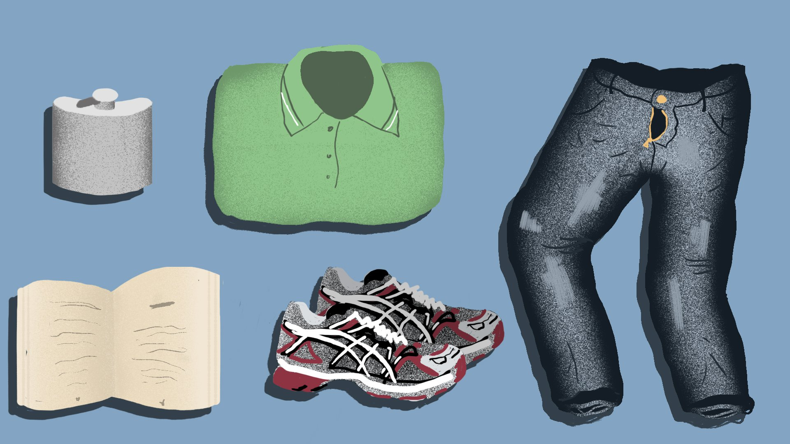

# Поколение "вискарик". Придурь стареющего мужика

Эх, девочки в интернете --- все моложе и моложе, а ты --- все старее и старее. И как тут не начать их презирать?

Анастасия Сутягина 13 сентября 2017

Мужчина "около тридцати" с неопрятной щетиной и явным избыточным весом в зоне "трудовой мозоли" уверенной, но усталой походкой вошел в квартиру после тяжелого дня, проведенного на нелюбимой работе. Он недовольно что-то гаркнул в ответ на вопросы суетливой пожилой женщины, вероятно, его матери, и прошел в свою комнату.

Прошел, словно освободился от несправедливости и глупости окружающего мира, прошел как в заветное чистилище, как в королевство, единолично управляемое им. Он окинул взглядом знакомую до боли в сердце комнату. Да, все --- на своих местах: все те же поблекшие от солнца дешевые обои, все тот же скрипучий шкаф позднесоветского периода, все та же никогда не заправляемая им кровать. Мать бы, наверняка, прибрала тут, если бы он позволял ей пересекать порог его комнаты. Но главным достоянием, его гордостью, конечно же, был стол с мощнейшим компьютером, оснащенным всеми, может и не передовыми, но безусловно лучшими, по его мнению, аксессуарами. "С зарплаты куплю себе новое кресло", --- подумал он и улыбнулся этой мысли: "А сейчас пора за работу..."

> Он снял растянутые в коленях брюки и сел за компьютер. Пальцы сами начали набирать текст, весь день вынашиваемой им статьи.

Сегодня на повестке --- просвещение несведущей молодежи в глупейших модных тенденциях молодежи сведущей. Бабы... Можно ли назвать бабами представительниц женского пола ориентировочно 15-17 лет?  В общем-то, без разницы. Суть --- в другом. Опять они выдумали что-то новое и стадно стали примерять это на себя. Если раньше они не любили читать, делали романтичные селфи и были натурами сверхчувствительными (что, если честно, тоже его не удовлетворяло), то теперь они (что гораздо страшнее) все без исключения остригли волосы, стали читать книги вне школьной программы и интересоваться современным искусством и кинематографом, стараясь наполнить себя знаниями и стать интересными собеседницами. Вот зачем они это делают??? Неужели они, глупенькие, не понимают, что все участие Правильной Девушки в диалоге с Мужчиной сводится к тому, чтобы восхищенно внимать его речам, поражаясь тому, как он может раскритиковать любую точку зрения?

Ну что поделаешь, придется объяснить подробно этим дурашкам, где их место в жизни. А кто это еще сделает, как не он сам?

**А судьи кто?**

В чем разница между критическим мышлением и полной ограниченностью мысли? Ответ прост --- человек с критическим мышлением видит положительные стороны, в то время как человек ограниченный осуждает все, что только возможно.

Почему человек осуждает все, что попадается ему на пути? Тут все тоже объясняется очень просто. Такой человек закован в собственные комплексы. Именно критика больше всего ранит его, а, как известно, лучшая защита --- это нападение. Этот человек не уверен в себе, но делает вид, что он --- Король Мира (а возможно, и сам Господь).

**Как ему это удается?**

Он поднимает собственную самооценку, осуждая других. Как правило, анонимно и/или выбирая беззащитных перед ним жертв. Он никогда не выбирает равного оппонента. Если это мужчина, то обычно гонениям подвергаются девушки, или дети, или самозабвенно любящие его люди (что происходит по совершенно необъяснимой, фантастической причине, откуда-то из области библейских сюжетов или фантастических романов и встречается чаще, чем можно себе представить).

Интересно, что же такой мужчина сделает, если осознает, что недооценил оппонента. После точно не установленного наукой количества попыток обороняться "аргументированно", он ментально отбегает на безопасное расстояние и начинает ненавидеть издалека.

Что делать, если такой мужчина встретился на вашем жизненном пути? Спасаться! Такие мужчины, несмотря на свою внешнюю непрезентабельность, могут быть весьма хорошими манипуляторами. Вы и глазом моргнуть не успели, как вы уже запутались в паутине его абсурдных, агрессивно-убедительных аргументов и начали постепенно терять собственное Я. Переубедить его даже не трудно, а просто невозможно. Ведь он не озабочен поиском истины или еще какой-то глупости в этом роде. Он хочет считать так, как он считает. Не меняя своей позиции, он чувствует себя защищенным, как в коконе, и сильным, как незыблемая скала. А признать свою неправоту для него страшнее, чем перейти Гранд-Каньон по канату. Это страх быть униженным. Страх, что кто-нибудь поймет, что вся его крутость и брутальность --- это напускное, всего лишь пыль в глаза, под которой, как только она осядет, окажется всего лишь озлобленный и недолюбленный ребенок.

Такие мужчины встречаются, к величайшему сожалению, довольно часто. И если бы мы условно обозначили их общность субкультурой и дали бы какое-нибудь идиотское, оскорбительно-неправдоподобное название, то обнаружили бы и единый стиль заданной нами субкультуры, а также много схожих черт в интересах и внешнем виде. Давайте начнем с последнего.

## **ВНЕШНИЙ ВИД**

Примерять на себя всякие моды --- совершенно неприемлемо для мужчин, загадку которых мы попытались разгадать выше. Им, безусловно, очень импонирует женское внимание, но главная задача лукa, выбираемого ими, заключается в том, чтобы скрыть данный неудобный факт.

Прическа, растительность на лице --- все это должно выглядеть так, будто весь тлен и рутина, связанные с уходом за волосами, совсем не интересуют этого мужчину.

Штаны, скорее всего, будут плохо сидеть: слишком длинные, складываются гармошкой или соприкасаются с асфальтом при ходьбе, возможно, на размер больше, но модель обязательно нарочито устаревшая. Футболка-поло (обязательно нефирменная). Еще чаще можно встретить его в футболках --- мерче малоизвестных заграничных и отечественных рок-групп. Обувь, как можно догадаться, заношенная, либо нефирменная, либо бренда, весьма им лично уважаемого, но тоже имеющая весьма непритязательный вид.

## **МУЗЫКА**

Хотелось бы назвать парочку примеров, но группы, которые он слушает, настолько непопулярны, что, возможно, о них знают только два человека --- этот мужчина и мама солиста.

Это только старые, проверенные временем исполнители. Не слишком энергичные, но и не слишком занудные рок-группы.

Когда такие мужчины приходят на концерт любимой группы, им важны две вещи: чтобы не было малолетних девочек и чтобы можно было спокойно, не тревожась, попить пиво из пластикового стакана, наслаждаясь звучанием инструментальной партии.

## **ЛИТЕРАТУРА**

Антиутопии? С удовольствием! Научная фантастика? Дайте две, пожалуйста. Да, такие парни обязательно до дыр зачитывают Стивена Кинга. Пожалуйста, не говорите им, что это несерьезная, не соответствующая их возрасту литература, если не хотите спровоцировать их на тираду, оскорбляющую вас или (боже упаси, если вы --- девушка) весь ваш пол.

Вообще, читать слишком много книг --- не для этих мужчин. Для них куда привлекательнее и практически полезнее полунаучные статьи, найденные ими на просторах Рунета или переведенные с английского. Знания языка, как правило, у них достаточные для этого. Но даже если и нет, слава богу, изобретен онлайн-переводчик! С этим придется попотеть, но чего уж только не сделаешь, чтобы блеснуть эрудицией перед своей публикой (в основном той, что в интернете, но немного и перед мамой, и перед бедной девушкой, которую он избрал своей спутницей жизни до тех пор, пока она не закончит школу).

## **КИНО**

Аниме --- очень даже можно. Даже рекомендуется. Нельзя же все время только поучать свою дурашку. Иногда надо предложить тему для обсуждения, в которой и она разбирается. Помимо аниме подходят многосерийные очень взрослые мультфильмы, например "Рик и Морти".

Сериалы приветствуются, но только без соплей! Для настоящих бруталов, можно приправленные насилием и разного рода извращениями. "Игра престолов" к просмотру обязательна, "Американские боги" --- по желанию.

В фильмах главное --- нигилистское начало или якобы глубинный смысл, лежащий на самой поверхности и являющийся основной темой. Это, наверное, дает им ощущение связанности с чем-то высоким, принадлежности к нему.

## **ВЫСТАВКИ**

Тут два варианта развития событий: либо он обожает выставки потому, что прочитал все, что мог, про направления, стили, представителей вида искусства и считает, что понял все об этом, либо он избегает их, критикуя всячески, называя слишком модными, чтобы озарять их своих присутствием. Главное правило --- никакого современного искусства!!! Все непонятное такому мужчине не должно вообще существовать, а если и появилось --- немедленно отправляться в печь.

## **ВИНО**

Вино они, по-честному, не пьют. Пьют, как правило, хороший виски. Где они находят хороший виски в России и на какие деньги его покупают, пока остается тайной. Но они обязательно объяснят вам, какой виски хороший, а какой --- плохой, если вы попросите. Ведь они так любят одаривать людей своим личным мнением, которое совсем не субъективное, а, конечно же, построено на чем-то солидном, вроде статей в интернете. Часто их можно встретить с пивом --- бутылкой/банкой/стаканом/всем, во что нальют. Неважно, какое пиво. Главное помните, что эта марка --- самая лучшая.

## **ИТОГ**

Что же мы имеем? Очень неприятного и в общении, и внешне человека, который разбирается ни в чем и во всем одновременно, любит и к месту, и не к месту высказывать свое грубое и оскорбительное мнение. Наверное, этот мужчина послан на Землю инопланетянами, чтобы воспитывать нас, темных, и сиять вместо Солнца в том случае, если наше действующее светило вдруг погаснет.

[Source](https://thisis.media/kultura/pokolenie-viskarik-pridur-stareyushchego-muzhika)
