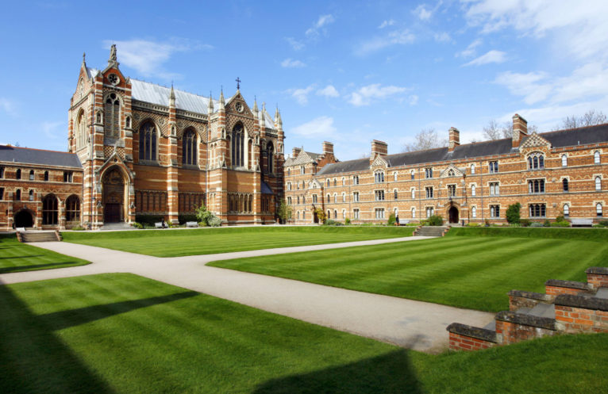
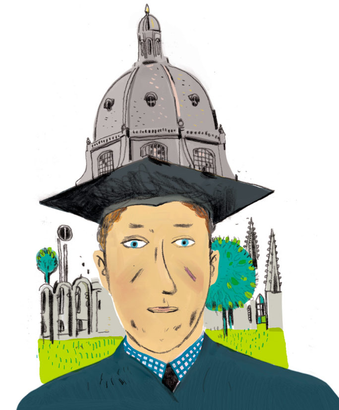
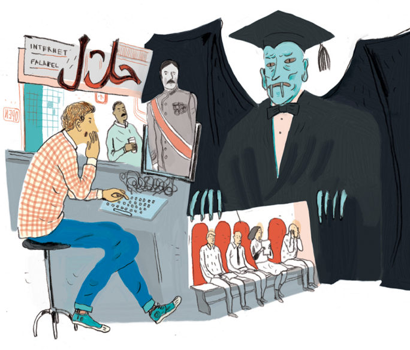
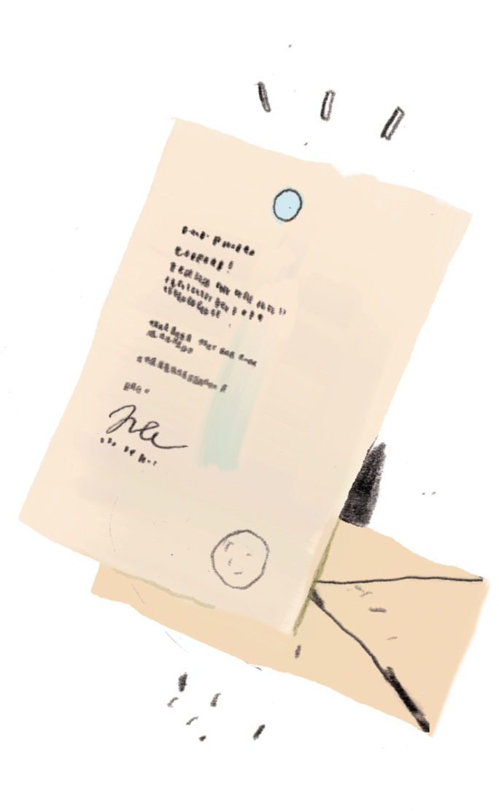
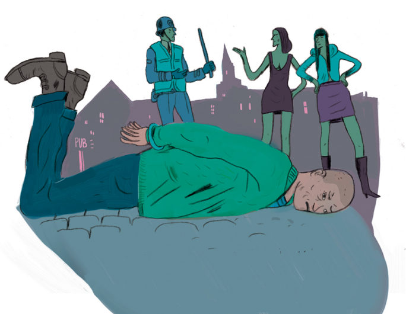

# Секс, трава и классовая ненависть в Оксфорде

Чему на самом деле можно научиться в старейшем университете мира

Скажи «Оксфорд», и в голову лезет что-то из Ивлина Во вперемешку с «Гарри Поттером» – пятисотлетние газоны, трехсотлетние корпуса, твид и римское право. Анонимный выпускник старейшего университета мира написал для GQ текст о том, чему на самом деле учатся в Оксфорде.

## ИНСТРУКЦИЯ ПО ПОСТУПЛЕНИЮ

Моя рука сжимает листок с анонимным источником. Через сорок пять минут я должен буду держать по нему ответ перед комиссией из трех донов. Я с трудом могу представить себе даже одного дона, но мое сознание наделяет этих существ клыками, щупальцами и перепончатыми крыльями. Я понимаю, что это один из тех моментов, которые определят мою жизнь. Место действия – Оксфорд. Время – середина нулевых. За тяжелой резной дверью проходят вступительные собеседования на факультет истории. Мне хочется ущипнуть не себя, а кого-нибудь другого, причем как можно больнее. Я начинаю сильно жалеть, что ввязался в эту авантюру. К тому же я воздержался от привычного ритуала с утра, и организм возмущенно требует тетрагидроканнабинола. Кругом мрачно корпят над листочками мои непосредственные конкуренты, все как один – коренные англичане. Гулкий готический зал пропитан страхом. Разумеется, я вообще ничего не знаю. Ни об источнике, который предстоит устно проанализировать, ни о правлении Карла I в целом. Мое смутное представление о мировой истории сводится к романам Юлиана Семенова и теории Гумилева о пассионарности. Еще меньше я знаю об Оксфорде. Мой отец – программист из Черноголовки, вот уже сколько лет работающий в интернет-кафе в Бирмингеме. В интернет-кафе. И тут меня посещает божественное озарение. Я понимаю, что во всем зале нет ни одного представителя университета – одни перепуганные школьники, ждущие, когда их имя выкрикнут из-за двери. Я как можно спокойнее покидаю зал, пересекаю увитый плющом внутренний двор и, беспрепятственно выйдя на улицу, скрываюсь под вывеской Halal Food & Internet, продублированной арабской вязью. За полчаса в «Гугле» я успеваю найти всю основную информацию о Карле I, идентифицировать анонимный источник и усвоить вызванную им полемику между историческими школами. И вернуться к резной двери в тот самый момент, когда из-за нее слышится мое имя. Через неделю я получаю письмо на гербовой бумаге об успешном зачислении в Оксфорд.

## ОБРЕЧЕННЫЙ НА СЧАСТЬЕ

Какое-то время я еще горжусь тем, как ушлое дитя постсоветской реальности обвело вокруг пальца учреждение с тысячелетней закалкой. Разумеется, я ошибаюсь: сработали совсем другие механизмы. Чтобы объяснить, какие именно, нужно рассмотреть внутреннюю механику университета, скрытую от посторонних глаз. Сразу отбросим аспирантов – они не являются частью оксфордского микрокосмоса. Жизнь аспиранта в Оксфорде мало отличается от жизни его собратьев по всему миру и состоит из одиночества, мастурбации и сизифова труда по болезненно узкой теме, плоды которого пять лет спустя прочитают по диагонали полтора преподавателя. Подавляющее большинство оксфордских аспирантов – иностранцы, загнанные в резервации и плотно сидящие на антидепрессантах. В столовых они сбиваются в унылые, плохо одетые стайки и трапезничают отдельно. Студент, желающий после окончания бакалавриата продолжать учиться, воспринимается как фрик. Казалось бы, почему, ведь именно аспиранты, а не студенты являются авангардом научного сообщества? Да потому, что при всех бесспорных научных заслугах подлинная миссия оксфордского образования – не академическая, а культурно-политическая и воспитывает не ученых, а кадры. Дипломатов, светских львов, банкиров, юристов, высшие армейские чины. Оксфорд – в первую очередь инкубатор по воспроизведению английской элиты, окончательно заточенный в XIX веке под бесперебойное обеспечение Британской империи управленцами и претерпевший с викторианских времен скорее косметические изменения. Действующий глава университета – последний британский губернатор Гонконга. За последние сто лет 10 из 17 премьер-министров Великобритании окончили Оксфорд. Зачем управленцу аспирантура и шапочка-конфедератка с кисточкой? У него есть диплом бакалавра и пробковый шлем.

Остаются студенты. Традиция учит, что пробковые шлемы должны быть укомплектованы не просто светлыми головами, но светлыми аристократическими головами англиканского вероисповедания. Всё прочее – не более чем уступки реалиям деградировавшего внешнего мира, постепенно навязавшего Оксфорду католиков, нуворишей, отпрысков колониальных царьков, женщин, безбожников, цветных, средний и даже рабочий классы. Но по сути, традиция сохраняется: вся система обучения и времяпрепровождения до сих пор целиком подстроена под дворянство, составляющее на сегодняшний день около 50 % учащихся. Это выпускники элитных частных школ типа Итона и Вестминстера, которых по Англии – от силы 10 % всех учебных заведений. Сто лет назад, пока Англия не лишилась имперско-аристократической гегемонии, эти школы поставляли 100 % оксфордских студентов. Но империя все равно наносит ответный удар. Навязанные извне 50 % – все эти «талантливые черные математики из неблагополучных семей» – равноправно крутятся в инкубаторе три года, напоследок гордо фотографируются с дипломом и счастливыми родителями, после чего возвращаются в ту же среду, из которой вышли три года ранее. Они пополняют ряды учителей, мелких госслужащих, офисных работников. Переезжают обратно к родителям в валлийское село с невыговариваемым названием. Остаются на аспирантуру. А их недавние соседи по общежитию и друзья по фейсбуку уходят в дальнее плавание по коридорам власти. Больше они никогда не пересекутся.\
Но это потом. А при ежегодном наборе студентов действуют квоты, формально примиряющие прогрессивную общественность с существованием элитарного инкубатора. На каждый курс должно быть принято как минимум столько-то иностранцев. Выпускников государственных школ. Северян. И так далее. Форсировать квоты – бессмысленно, так как это приведет к плачевным результатам экзаменов и падению рейтинга университета. Но если ты не глуп и при этом попадаешь в одну из категорий, тебя оторвут с руками. Вернемся ко мне: по стечению обстоятельств на момент подачи документов в Оксфорд я был неглупым иностранцем из небогатой семьи, выпускником государственной школы в Бирмингеме. Так что, конечно, хорошо, что я придумал зайти в интернет-кафе, – есть о чем рассказать за пивом в лицах.\
Но, выражаясь словами Довлатова, я был заведомо обречен на счастье.

## ДВА С ПОЛОВИНОЙ ОКСФОРДА

Читателю может показаться, что я сгущаю краски, ведь и в российских вузах учится золотая молодежь вперемешку с простыми смертными. Читатель скажет, что не может быть тотальной сегрегации в рамках одного учебного заведения. Но читатель оперирует реалиями России – страны, чья потомственная аристократия была истреблена и размыта сто лет назад и чья элита берет начало в 90-х либо в советской номенклатуре. Английская же элита не менялась веками, она закреплена биологически. Достаточно вспомнить, что последнее крупное внутреннее потрясение для Англии – гражданская война XVII века. С тех пор классовая система претерпела минимальные изменения, и, когда попадаешь в Оксфорд, это быстро становится очевидно. Михалковы – не династия; династия – это когда выясняется, что средневековая столовая, в которой мы обедаем, была построена в XVI веке на деньги предка моего однокурсника, что у предка была та же фамилия, которую он не преминул высечь на стене столовой и что в тех редких случаях, когда мой однокурсник ужинает в столовой, а не в рес­торане, он предпочитает сидеть под данной надписью.\
Отличительных черт высшей касты – бесчисленное множество. Во-первых, это пуленепробиваемая уверенность в себе (скорее спокойное сознание собственного превосходства, нежели хамоватая самоуверенность – эта вылезает только во время попоек). Во-вторых, это мгновенно узнаваемая речь: так называемое RP-произношение (в народе – Queen’s English), интонации и слова-маркеры, сами по себе подчеркивающие принадлежность говорящего к элите. В-третьих, внешний вид. Как и русского туриста в Европе, выпускника британской частной школы в Оксфорде можно безошибочно угадать со спины. Угадать по как бы небрежно и случайно, а на деле тщательно всклокоченной шевелюре, атлетическому телосложению (регби плюс гребля) и шмоткам в диапазоне от чересчур очевидных Abercrombie & Fitch / Jack Wills (низшая планка) до сшитых на заказ розовых брюк от оксфордского портного с Turl Street с желтым пиджаком, голубыми носками и антикварной тросточкой (высшая планка).

Наивные студенты из простых смертных поначалу еще пытаются завязать знакомства с верхами и даже целый месяц «для галочки» занимаются греблей, но, наткнувшись на стену из вежливого безразличия и осознав бесплодность своих усилий, быстро прекращают попытки войти в круг избранных. В присутствии высшей касты они начинают говорить невпопад, запинаться, ощущая блеклость своей речи, и переминаться с ноги на ногу в кедах из Next за £20. Даже маршруты, которыми передвигаются по Оксфорду феодалы и вассалы, настолько разные, что порой кажется, будто они живут в разных городах. Давайте вместе пройдемся по центру, и вы поймете, о чем я. Начнем в истинно плебейском месте – ливанской кальянной Al-Salam на Park End Street, любимом заведении местных казахов, коих великое множество. Дело в том, что – следите за руками – в городе Оксфорде находится не один университет, а целых два: знаменитый на весь мир Oxford University и ничем не выдающийся Oxford Brookes University, построенный в 90-х годах и не имеющий к именитому тезке никакого отношения. Но так как за пределами города об этом факте не знают, а между названиями города и элитарного вуза ставят знак «равно», то Oxford Brookes переполнен студентами из всех уголков бывшего СССР. По возвращении домой они могут, не привирая, сказать, что «окончили Окс­фордский университет», и продемонстрировать диплом при найме на работу. Кому в Азербайджане придет в голову, что оксфордских университетов может быть несколько? Особенно в этой схеме преуспевают казахи, чье дальновидное правительство субсидирует учебу на Западе. По схожему принципу на бренде «Оксфорд» паразитируют бесчисленные языковые и летние школы, пользующиеся популярностью во всем мире исключительно из-за географической локации. Побочным эффектом этого феномена является то, что летом город превращается в рай для постпубертатного пикапа: на улицы высыпают тысячи восторженных старшеклассниц и первокурсниц – латиноамериканок, азиаток и славянок, мечтающих о том, чтобы «оксфордский студент показал им город». Ко второму курсу один мой приятель настолько обленился, что сразу расставлял точки над i: «Из Бразилии? Сейчас я покажу тебе, где снимали «Гарри Поттера». Все равно моя комната находится в том же колледже...»\
Здесь следует сделать еще одно лирическое отступление и объяснить, что такое колледж. Наиболее распространенный вопрос туриста-неофита – «а где же само здание университета?». Такого здания нет. Oxford University – это конфедерация разбросанных по городу автономных административных единиц – колледжей, – объединенных общим сводом правил и экзаменационной комиссией. Каждый студент университета приписан к одному из сорока колледжей. Здесь он ест и спит, а также общается с великими и ужасными донами – его непосредственными академическими кураторами. Колледжи отличаются друг от друга уровнем престижности, политической и сексуальной ориентацией, архитектурой и финансовым благосостоянием.

Например, в то время как консервативному колледжу Christ Church принадлежит картинная галерея с оригиналами Тинторетто и Дюрера, готический собор и отрезок Темзы, на котором проводят соревнования по гребле между Оксфордом и Кембриджем, у либерального обшарпанного колледжа Templeton не хватает денег на канцелярские принадлежности. Да-да, верхний слой академического пирога тоже страдает социальным расслоением. Welcome to the layer cake, son.

## ВОЙНА МИРОВ

Но вернемся к нашей прогулке. Выкурив в компании казахов яблочную шишу под верещащие из колонок «Черные глаза», мы готовы идти дальше. Наискосок от Al-Salam начинается престижный район Jericho, населенный околоуниверситетской интеллигенцией – профессорами и фрилансерами. Обычно именно у этой прослойки снимают жилье потомственные аристократы, когда на втором курсе наступает время покинуть стены колледжа, дабы опериться и стать самостоятельными. Это не метафора. В колледжах к студентам по сию пору приставлен scout – обычно безукоризненно ­вымуштрованный, сильно пьющий пожилой англичанин, регулярно убирающий комнату и оттирающий оксфордские ковры от уже третьего поколения аристократической блевотины после светских гулянок. Мы с моим скаутом Фрэнком быстро нашли общий язык: за бутылку виски в триместр он вообще не появлялся у меня на пороге. Ну а район Jericho набит недешевыми кафе и ресторанами. Это территория элиты, особенно Freud’s – коктейльный бар, расположенный в здании бывшей церкви. Если повезет, то здесь можно лицезреть, как очередной обладатель смокинга, будучи не в состоянии стоять, с кающимся видом ползает на коленях по тому месту, где некогда стоял алтарь.

Вообще пить Оксфорд не умеет, но пьет нечеловечески много. Это приводит к дракам. Дело в том, что, кроме ненавистных туристов, студентов из верхов и студентов из среднего класса, существует немаловажная четвертая сила, о которой часто забывают. Это стотысячное городское население, преимущественно с рабочих окраин, вот уже сотни лет обслуживающее горстку приезжих умников, живущих в баснословно дорогом центре (цены тут равносильны лондонским). Как если бы этой исходной ситуации было мало, в нулевых годах ряд оксфордских заводов, в том числе тогдашний банкрот MG Rover, провел резкое сокращение штата. Центр города моментально наполнился безработным и злым пролетариатом, топившим в пинтах «Стеллы» предчувствие неминуемого скатывания от скромного кирпично-ипотечного дома к бетонному блоку с неграми и крэком (конкретнее – в район Blackbird Leys). Давайте вырулим из тихого Jericho на пабно-барную George Street пятничным вечером, и вы все увидите сами. Пейзаж напоминает «Войну миров» Уэллса. В воздухе стоит запах пролитого пива и разнообразных отходов человеческой жизнедеятельности. Два мента с безучастными физиономиями ведут, поддерживая за плечи, мертвецки пьяного студента, чем-то похожего на вожделенного для школьниц актера из «Сумерек». Как и подобает вампиру, его разбитый рот – в крови, порванная рубашка в темных пятнах, на голой шее болтается бабочка. Неподалеку лицом вниз, с руками, скрученными за спиной пластиковыми стяжками, лежит огромный рыжий детина в поло Lyle & Scott и, не замолкая ни на секунду, глухо ругается на неидентифицируемом диалекте; попытка транскрипции выглядит так: YE-FECKIN-CUNTS-ILL-FECKIN-KILL-YE-FECKIN-FECK. Через детину перешагивает, не обращая на него внимания, стая разногабаритных, но идентично одетых в розовое самок человека с красными рогами из плотного картона на головах. Их пронзительные визги на время заглушают ругань детины, смешиваясь с одобрительными скабрезностями с противоположной стороны улицы, где нетрезвым шагом следует в очередной паб группа молодящихся пятидесятилетних работяг в одинаковых рубашках навыпуск. Флирт и съем в пролетарской Англии возможен исключительно в серийном, массовом порядке, как коллективные свадьбы в армии Александра Македонского. Чуть поодаль, сидя на тротуаре, плачет немыслимо пьяная городская девочка с характерными золотыми обручами в ушах; непосредственно за ее спиной трое регбистов в полосатых пиджаках частных школ мочатся на средневековую стену, параллельно с этим поедая размякшие чипсы из желтой полистироловой коробки, которую по очереди протягивает своим товарищам мочащийся посередине спортсмен. На углу маячит шпана из социального жилья в капюшонах и тренировочных костюмах; их недоброе внимание явно сконцентрировано на вызывающе дорого одетой компании первокурсников, опирающихся друг на друга вследствие предельной степени интоксикации. Невдалеке слышны сирены. Вечер начинается.

## ОЧЕНЬ ГОЛУБАЯ КРОВЬ

Чтобы покинуть эту гоморру, нужно пересечь историческую Broad Street и свернуть налево, но тут мы выйдем к содому. Именно так среди студентов именуется элитарный колледж Wadham, при правильном произношении рифмующийся с Sodom: еще с XVIII века, когда глава колледжа бежал во Францию в связи с обвинениями в мужеложестве, Wadham пользуется сомнительной сексуальной репутацией. Что снова приводит нас к занимательной социологии, так как негласный бисексуализм британской элиты – явление сугубо классовое и статусное. Конечно, в Оксфорде есть и открытые геи «из народа», проводящие унылые семинары и раздающие на улице радужные флажки, но это плебеи от гей-комьюнити (можно ввести в обиход новое слово – «плегеи»). Аристократия не опускается до подобных ярлыков; ее половая всеядность в духе лорда Байрона скорее подразумевается, нежели декларируется, и восходит все к тем же частным школам, в первую очередь к закрытым мужским пансионам с их традиционной дедовщиной, ритуалами инициации и повсеместным культом Древней Греции по принципу «лучше нет влагалища, чем очко товарища». Можно без преувеличения сказать, что в великосветских кругах Англии этот школьно-университетский период неразборчивости до сих пор считается естественной частью становления мужчины, так же как последующая неизбежная женитьба на благородной девице из женского пансиона с целью достойного продолжения рода. Лишь в последнее время в связи с массовым нашествием простолюдинов, не способных прочувствовать тонкости мужской дружбы древнегреческого образца, общий уровень гомоэротизма в университете резко понизился. Раньше было не так. Вспоминая 30-е годы, ирландский поэт-алкоголик Луис Макнис писал: «Я обнаружил, что в Оксфорде все интеллектуалы – гомосексуалисты, а все спортсмены – гетеросексуальны. Мне нравились женщины, но я не занимался спортом. В итоге меня нигде не приняли, и я начал пить».

Закончим нашу социологическую прогулку в самом центре, на безлико-магазинной Cornmarket Street. Здесь на расстоянии ста метров друг от друга находятся два полюса университетского мира: студенческий клуб Oxford Union и студенческий бар Purple Turtle. Хотя членство первого открыто для всех и первокурсники из низов охотно платят немалые деньги за возможность поучаствовать в проводимых клубом политических дебатах, постоянная тусовка Oxford Union предсказуемо элитарна: здесь делало свои первые шаги большинство крупных игроков британской политики – от Тэтчер до Блэра. Здесь по-прежнему пьют херес, курят сигары и обсуждают новейшие скандалы, вальяжно развалившись на кожаных диванах, просиженных поколениями властителей дум. Человеку со стороны остается выпить за барной стойкой смущенную пинту и отправиться в «Фиолетовую черепаху» по соседству. Здесь все иначе. Вход со двора, оберегаемый угрюмыми вышибалами, ведет в глубокий подвал, заполненный броуновским алкодвижением. Преимущественно это волосатые и бородатые программисты, делающие вид, что они металлисты, провинциальные английские девочки с глуповатыми татуированными бойфрендами из городских, претенциозные юноши альтернативно-веганского вида, рассыпающие по столу табак из очередной неаккуратной самокрутки, и прочие либеральные отбросы консервативного инкубатора. Тут можно пофлиртовать с распутного вида барменшей, посетовать на то, как быстро продалась бездушной индустрии очередная надежда инди-рока, а главное – быстро и безобразно нажраться. Аристократы если и попадают в «Черепаху», то лишь на финальной стадии опьянения. Белая кость не презирает средний класс, она просто его не замечает. Пролетариат и деклассированные элементы как минимум интересны в той же мере, в которой английским путешественникам XIX века была интересна аномальная длина клиторов у представительниц африканских племен. Для этого сугубо викторианского любопытства и его гротескных объектов есть даже подходящее, отдающее кунсткамерой слово — curiosity (то самое, которое у Диккенса в The Old Curiosity Shop). Все, что нельзя заспиртовать и продемонстрировать своим рафинированным друзьям летним вечером на веранде родового поместья, сопроводив искрометным рассказом, не представляет ценности для элиты. Интересна либо завораживающая красота, либо патологическое уродство; либо расточительное богатство, либо чудовищная нищета. Я не цитирую Уайльда, это – дословный пересказ нетрезвой, но очень симптоматичной беседы первокурсников во время празднования бароном Н. своего совершеннолетия в пятизвездочном отеле. Внимательный читатель заметит, что, учитывая социальный статус автора, он никак не мог быть допущен к такому обществу и к таким речам. Читатель прав, но забывает о единственном факторе, объединяющем, пусть и на сверхкороткое время, нации и классы. Это наркота.

## ТАКСИ НА ЧЕТВЕРЫХ ПАССАЖИРОВ

В середине 2000-х унция обычной травы, продаваемой на юге Англии по четвертинкам, приносила около £140, а если раскидывать 10-фунтовыми пакетами – то намного больше. В то же время в существенно менее благополучном Бирмингеме унция нормального стаффа, взятого у бывших одноклассников, стоила мне £40. Я поразмыслил над этой простой формулой, прикинул стоимость месячного проездного на рейсовые автобусы National Express и принялся за дело. Родители были рады (хоть и несколько удивлены) видеть меня каждые вторые выходные, а я мнил себя вторым Говардом Марксом, крупнейшим торговцем марихуаной 70-х, заложившим фундамент своей империи во время учебы в Окс­форде на факультете физики. Первые два грамма я продал Алистеру, выпускнику Итона, прямо на лекции по истории, когда у того из сумки выпал гриндер. Отец Алистера был известным историком с авторской программой на Би-би-си, а в прошлом – советником Джона Мейджора. Уже начиная со второго триместра, Алистер брал у меня по пол-унции в неделю и вскоре перестал ходить на лекции. Зато он познакомил меня со своим кругом друзей, которые все были на одно лицо – кровь с молоком, взлохмаченные гривы, произношение как у Стивена Фрая, респектабельные имена (Руперт, Себастиан, Лоренс) и двойные фамилии через дефис. И у всех – предвкушение накурки в глазах.\
Несмотря на то что я взял за правило толкать бирмингемское сено по £20–30 ниже стандарта, за все время среди моих покупателей не побывало ни одного представителя среднего класса. Я быстро понял, что дело не только в покупательной способности (хотя ребятам типа Алистера действительно было по большому счету по барабану, сколько платить, торговались они редко, и то лишь для того, чтобы произвести впечатление на своих девочек, обладательниц столь же тщательно всклокоченных причесок). Реальная причина была в том, что люди попроще могли сами пойти и без проблем найти дурь, полагаясь на простейшее чутье. Действительно, что тут сложного? У многих были связи с городскими и постоянные поставщики. Аристократы же оказались начисто лишены основных инстинктов, в первую очередь – навыка разговаривать с простыми людьми. Все школьные годы, изолированные от внешнего мира в пансионе среди бескрайних английских полей, они вешали на стены плакаты с листиком анаши и брали траву у одного и того же мегапопулярного одноклассника. Мир за пределами школы представлялся им опасным и экзотичным, окраины Оксфорда – чуть ли не Бронксом, а покупка пакетика плана – серьезной уличной миссией. Разумеется, мой маленький бизнес расцвел.

Моими единственными конкурентами в борьбе за состоятельную клиентуру оставались таксисты. Дело в том, что оксфордская преступность крайне эксцентрична. Если в других городах угоняют машины, то в Оксфорде – велосипеды (массово и крайне эффективно, с помощью фургонов и электропил). Одного выпускника Хэрроу при мне увезли в обезьянник за то, что он в нетрезвом виде «обвинил лошадь полицейского в гомосексуализме», и продержали до утра. С наркотой тут тоже все не как у людей. Большинство травы и таблеток продается не организованно, а кем попало вроде меня. Единственные, кто привносит в этот хаос некое подобие организованности, – это таксисты. Нужно лишь набрать номер и заказать такси для нескольких пассажиров по такому-то адресу. «Пассажир» – это четверть унции, «два пассажира» – пол-унции. Таксист приезжает по адресу и отдает нужное количество – разумеется, с дикой наценкой за быструю и остроумную доставку. Аристократы с радостью раскошеливались. Однажды друг Алистера по синей лавочке перепутал номера и позвонил в другую компанию, после чего долго пытался намеками получить стафф от недоумевающего таксиста, приехавшего действительно забрать пассажиров. Впрочем, так или иначе приторговывают все таксисты. «Нашу компанию основали два брата, Абдул и Фариз, – сказал мне один из них, когда я к третьему триместру начал шиковать и периодически ловить кэбы, – сейчас у нашей компании 80 машин. А поначалу у Абдула и Фариза не было даже одной! Они просто продавали траву, купили на эти деньги машину и начали развозить стафф. А однажды они просто подвезли кого-то и подумали: «Можно же еще параллельно и таксистами работать...»\
Однако я нашел управу и на таксистов. Два слова...

## ПРЯМОЙ МАРКЕТИНГ

Продажа травы в Оксфорде – это тебе не секундная передача через рукопожатие на углу. Социальная интеракция неизбежна. Тем более что, за исключением торчков типа Алистера, стафф обычно пробивают во время вечеринок. Надо прийти, обменяться парой-тройкой малозначительных фраз с покупателем и его друзьями, произвести хорошее впечатление. В эти моменты я стал замечать, что любое мое мало-мальски адекватное высказывание на нормальном английском языке, будь то саркастическое замечание о погоде или уместная цитата из монолога полковника Курца, вызывали недоуменно поднятые брови и молчаливое недоверие высшей касты. Типа, ты же барыга, да еще и русский, ты чего это? Ты куда лезешь? И напротив – стоило мне ошибиться в произношении или спросить вполголоса «а где здесь туалет?», как в ответ следовал приветливый хохот, похлопывания по спине, приглашения выпить с хозяевами и обилие новых контактов. Я начал врубаться в тему. Им нужен был не просто поставщик травы, а curiosity – вызывающий интерес объект, который можно продемонстрировать скучающим друзьям: русский барыга, да еще из Бирмингема!

Спрос рождает предложение. Я побрил голову налысо. Купил кожанку. Прошел хитрую обратную эволюцию по восстановлению потерянного за годы жизни в Англии убедительного русского акцента. Для верности приобрел в Бирмингеме партию колес (50 пенсов за штуку при оптовой покупке ста таблеток; £5 за штуку при розничной продаже в Оксфорде). Перестал говорить о политике и погоде. Перестал использовать латинизмы в речи. Взял за правило часто рыгать, материться по-русски и рассказывать бесконечные непристойные анекдоты. Если бы в Оксфорде можно было достать балалайку и циркового медведя, я бы и им нашел применение. Я был в ударе. Я был квинтэссенцией русофобского лубка. Успех превзошел все ожидания. Через месяц я понял, что не справляюсь с количеством работы, а оборот денег и травы становится небезопасным. Об учебе речь не шла уже давно (к счастью, на втором курсе нет экзаменов). Для обдолбанных регбистов я был свой в доску русский парень. Для их подруг я был charming creature, особенно когда пускал паровозы. Жеманные эстеты с расширенными зрачками, нарочито игравшие в героев Ивлина Во, жаловались мне на своих ветреных бойфрендов. И все хотели дуть. Я узнал, кто с кем спит и чья семья на грани банкротства. Постоянно прописался в Oxford Union, не заплатив ни копейки за членство. Я побывал даже там, куда не ступала нога выпускника государственной школы, – в святая святых английской аристократии, в загородных домах, на закрытых вечеринках типа А (эротизированный маскарад) и В (попойка с последующим уничтожением имущества – пригласили, когда прошел слух про таблетки). На знаменитых закрытых вечеринках типа С (разнузданная оргия) я не побывал лишь потому, что не продавал кокаин – намного более популярное вещество в данных кругах. Быть может, именно там и происходило все самое интересное, в духе кровавых оккультных ритуалов, описанных конспирологом Дэвидом Айком в его цикле статей об Оксфорде. Если честно, то я очень сильно на это надеюсь. Потому что то, что мне удалось увидеть в процессе моего неожиданного социального взлета, было обыденно до ужаса. Большое количество пьяных и упоротых тел, находящееся на ограниченном пространстве, лишено национальной и классовой специфики. С какого-то момента это просто биомасса, не отличающаяся от пьяных казахов из Al-Salam и неряшливых субкультурщиков из Purple Turtle. Я был разочарован. Недостижимый центр оксфордского мироздания оказался пустышкой. Лучше бы аристократы действительно ели детей. К третьему курсу мы с британской элитой нечеловечески устали друг от друга.

## P. S.

Я стою на крыльце Exam Schools, одетый в допотопную черную мантию выпускника, и докуриваю последний грамм бирмингемской травы. Моего поставщика посадили. Алистера отчислили. Я сдал экзамены и получил третью степень – худший из оксфордских дипломов. Разумеется, вне Оксфорда данная иерархия никого не волнует. Слова «диплом Оксфорда» и так вызывают священный трепет. Говорят, что образование – это то, что остается, когда забываешь все, чему учили. Чему меня научил Оксфорд? Узнавать аристократов со спины. Продавать траву. Играть в опереточного русского. Научил тому, что социальная сегрегация – это правильно и хорошо. Я по-прежнему не обладал какими-либо значимыми связями в английской элите. По-прежнему не имел ни малейшего понятия о том, кем был Карл I. Зато я понял, что у меня действительно хорошо получается.

В следующей жизни я поступлю в Лондонскую школу экономики.

[Source](https://www.gq.ru/entertainment/seks-trava-i-klassovaya-nenavist-v-oksforde)
