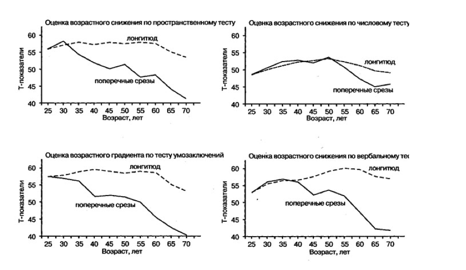
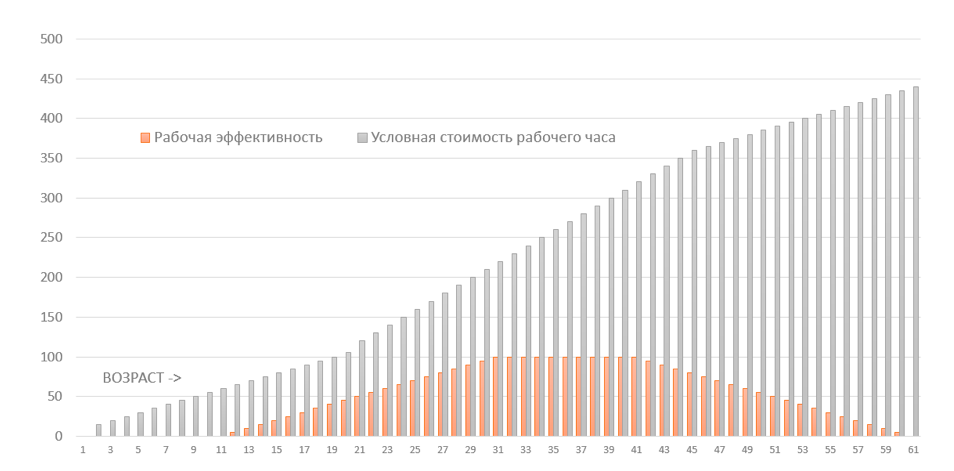
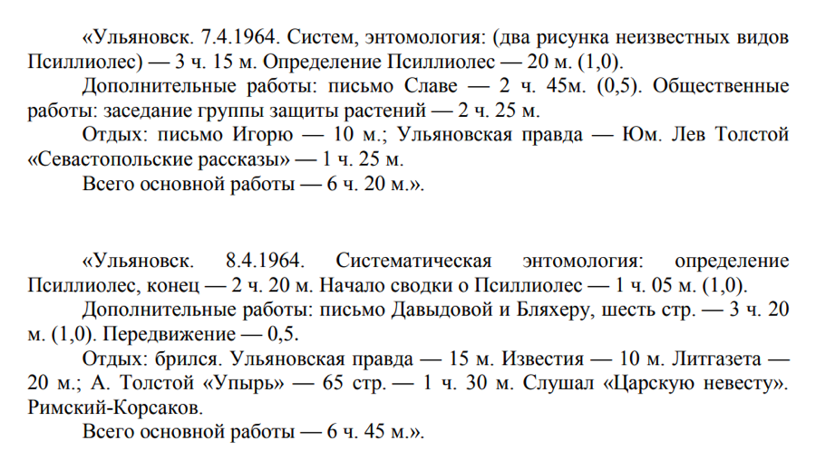

# «Мы сражаемся за каждую минуту жизни, поэтому к чёрту сентиментальность»

Владелец digital-агентства [Fu2re](http://www.fu2re.ru/) Данил Дехканов об определении «стоимости» личного и рабочего времени и анализе его затрат.

## Нужен ли вам тайм-менеджмент

Многим людям по всему миру и вовсе не нужна эта наука --- управление временем. У современного человека достаточно много свободных часов, и фраза «у меня нет времени» --- лишь отговорка для того, чтобы отвязаться от неинтересной задачи и переключиться на другое занятие.

Для иллюстрации современного отношения ко времени показателен такой случай: администрация аэропорта Хьюстона получала множество жалоб от пассажиров, которые слишком долго ожидали свой багаж. Аэропорт нанял больше грузчиков, но жалоб не становилось меньше. Тогда путь пассажиров от трапа до транспортеров с багажом увеличили в шесть раз. Время, которое прежде уходило на ожидание багажа, люди стали тратить на дорогу. И жалобы прекратились.

Большинство людей из «[золотого миллиарда](https://ru.wikipedia.org/wiki/%D0%97%D0%BE%D0%BB%D0%BE%D1%82%D0%BE%D0%B9\_%D0%BC%D0%B8%D0%BB%D0%BB%D0%B8%D0%B0%D1%80%D0%B4)» уделяют внимание какой-либо задаче против своей воли. Те цели, что перед ними ставятся со стороны, они не ощущают своими и чувствуют, что их энергия расходуется напрасно. Время, потраченное не на достижение личных целей, а на вынужденную работу --- то есть навязанную обстоятельствами ношу, мешающую наслаждаться жизнью --- считается потраченным впустую.

И даже если в этот момент работа доставляет людям удовольствие, они игнорируют стратегические цели компании, потому что те никак не связаны с их долгосрочными жизненными целями. Ещё печальнее, когда у людей вовсе нет долгосрочных целей и вся их жизнь состоит из цепочки событий (иногда случайных), сиюминутных желаний и спонтанных дофаминовых наград, служащих единственной мотивацией к существованию.

Если вы не узнали себя в этих строках и у вас есть цель, к которой вы стремитесь всей душой, но у вас не хватает времени для её реализации, то читайте дальше. Если же узнали, то не думаю, что этот материал окажется вам полезен.

## Целеустремлённость и ваше будущее «я»

Самый целеустремлённый человек --- тот, который спешит в туалет. Вроде бы простая мысль, однако вспомните, как вы становились мастером тайм-менеджмента и логистики во время приступа диареи. Каким ясным становилось сознание, как перед мысленным взором открывалась голографическая карта местности и расчёт времени и расстояния до ближайшей уборной.

Это довольно посредственный пример. Однако мы, рассуждая о мотивации и стремлении достичь какой-то цели, очень часто не можем себе представить то, каким будет наше новое «я». Зато в примере с туалетом довольно легко можем вообразить, каким будет это самое «я» в случае недостижения вовремя поставленной цели. Вот почему он работает.

Самый простой способ замотивировать себя к достижению какой-то цели --- это визуализировать себя в том новом состоянии, которого хочется достичь. И чем подробнее, чем ярче вы представите себе этот образ, тем проще будет поддерживать мотивацию.

Одно из наиболее любопытных человеческих заблуждений состоит в том, что мы думаем о себе в будущем как о совершенно другом человеке. Мы склонны идеализировать себя, ожидаем, что будущие «мы» сделаем то, что нам настоящим сделать не получится. Другими словами, у «будущего» вас всегда больше времени, сил и воли, чем у вас настоящего.

Экономист из Аризонского университета Анна Бреман провела исследование относительно будущих «я» и попросила спонсоров благотворительных проектов в развивающихся странах выбрать две разные стратегии пожертвований. При стратегии «дай больше сейчас» спонсоров просили увеличить ежемесячные пожертвования, начиная со следующего платежа.

При «дай больше завтра» спонсоров тоже просили увеличить ежемесячные пожертвования, но лишь спустя два месяца. Во втором случае спонсоры потратили на благотворительность на 32% больше денег, чем те, кто попал в программу «дай больше сейчас».

Поэтому не стоит «нагружать» свои будущие «я» какими-то сверхспособностями и сверхожиданиями. Просто посмотрите, каким вы стали сегодня по сравнению с собой пять лет назад, и вам станет понятно, каким вы можете стать в будущем.

## Цикл управления временем

Круговорот оптимизации времени похож на многие другие эволюционные процессы и состоит из следующих этапов:

1. **Постановка главной цели и максимально возможного количества связанных с ней промежуточных целей.** Не поленитесь и как можно подробнее распишите промежуточные цели. Фактически это самый важный шаг --- ваше видение того, каким станете вы или ваша компания в конце пути и как вы будете идти к этой точке.
2. **Нахождение способа измерения собственного прогресса в рамках выбранной системы целей.** Если у вас не будет своих KPI --- понятных, «осязаемых» и конкретных (без размытых формулировок вроде «повышение уровня счастья на 15%»), --- то вам будет довольно сложно идти по выбранному пути и отслеживать свой прогресс.
3.  **Сохранение предельной сосредоточенности на происходящем**. Ежедневное продвижение к цели, пусть даже и на несколько шагов --- важный этап в закреплении своей позиции и перемещении себя «прошлого» в настоящее.

    Иногда это проходит довольно легко (например, если вы в состоянии «потока»), иногда приходится, подобно барону Мюнхгаузену, вытаскивать себя за волосы из болота прокрастинации или рутины и возвращать на путь к выбранной цели.
4.  **Оценка препятствий, поиск пожирателей времени и путей оптимизации.** После проделанной работы не спешите расслабляться. Не поленитесь и выделите пару минут на то, чтобы оценить временные затраты на решение всех промежуточных задач и увидеть способы их сокращения.

    Иногда достаточно оглянуться назад, чтобы увидеть, что этот маршрут можно было пройти иначе, более быстрым путём (особенно если вы уже поднялись повыше и вам открывается неплохой обзор). На пожирателях времени мы остановимся подробнее ниже.
5.  **Награда за достижение промежуточной цели.** Не забывайте про дофамин --- нейромедиатор, влияющий на обучение (и развитие привычек) через подкрепление путем вознаграждения и наказания. Когда мы сознательно или бессознательно воспринимаем нечто как полезное и приятное, мы стараемся повторить такой опыт. В эти моменты дофаминовые нейроны в теле нашего мозга усиливают свою работу.

    Поэтому важно закрепить свой положительный опыт чем-то приятным, но желательно не вредным для здоровья и психики. Например, апельсином или прогулкой по лесу под любимую музыку.

## «Прокачиваем» рефлексы

Человеческий мозг имеет одну уникальную суперспособность, полученную в ходе эволюции, --- рефлекторное поведение. Обучение определённой группы нейронов путем повторения опыта позволяет мозгу накапливать информацию в виде легкоприменимых привычных схем, которые впоследствии быстро активируются при возникновении соответствующих подсказок от окружающей среды.

После запуска привычные схемы поведения легко функционируют автоматически, и затраты энергии на их выполнение сводятся к минимуму. Развитие и настройка такого рефлекторного поведения даёт огромные биологические преимущества: появляется возможность действовать «на автопилоте» и благодаря этому освобождать время для решения проблем, требующих больших мыслительных ресурсов.

Эти привычные схемы очень мощны и сохраняются длительное время. Вспомните, к примеру, как легко человеку снова начать кататься на лыжах или велосипеде даже после многолетнего перерыва или как на начальных стадиях болезни Альцгеймера больной вполне способен прилично вести себя в обществе, несмотря на нарушения кратковременной памяти.

В своей [статье](https://vc.ru/p/train-your-brain) «Ваш мозг --- ленивая сволочь» я подробно описал этот механизм и рассказал о рисках, связанных с деградацией разума. Однако никто не мешает постоянно развиваться и расширять набор таких привычек, постепенно осваивая всё новые и новые резервы мозга.

Поэтому, если на пути к вашей цели есть повторяющиеся операции, то никто не мешает использовать вышеописанный механизм для превращения их в рефлексы, которые позволят если не высвободить время, то хотя бы освободить разум для параллельного решения более сложных задач.

Правда, бывает, рефлексы дают сбой. Например, если более сложная задача требует больших ресурсов и забирает их у рефлексов. Например, однажды немецкий философ Иммануил Кант, обдумывая очередные постулаты своего трактата «Критика чистого разума», положил часы в кастрюлю с кипящей водой и попытался засечь по сжимаемому в другой руке яйцу необходимое для варки время.

## Формула расчёта стоимости каждого часа своей жизни

Если вам довольно сложно сформулировать глобальные цели и начать к ним стремиться всем своим разумом и телом, то попробуйте начать с того, чтобы взглянуть на время по-другому. Один из способов перестройки своего отношения ко времени как к ресурсу (определённо ограниченному) заключается в том, чтобы соотнести его с другим ресурсом, в ограниченности которого обычно сомнений меньше. Например, с финансами.

Когда вместо минут на условных часах начинают «тикать» деньги, отношение ко времени становится совершенно другим. Я, к примеру, каждый свой час оцениваю в денежном выражении. У меня есть своя формула, которая учитывает несколько параметров.

Скажем, через 20 лет скорость моего мышления и память будут уже не такими, как сейчас, следовательно, я смогу работать менее эффективно (соответственно, зарабатывать меньше), при этом на здоровье и отдых буду тратить больше ресурсов.

Не будем углубляться в различные исследования изменения IQ-потенциала в зависимости от возраста, достаточно взглянуть на графики ниже, вспомнить свою бабушку и понять, что в будущем наш мозг ждёт не самое продуктивное время.

Каждый Новый год я делаю перерасчёт стоимости рабочего часа, и этот показатель постоянно крутится у меня в голове. Все новые проекты и заказы я рассматриваю с точки зрения своей вовлечённости и сверяюсь со стоимостью часа, чтобы оценить, насколько мне выгодно ими заниматься и насколько дешевле и правильнее будет потратить своё время, а не время наёмных работников.

Стоимость рабочего часа рассчитывается довольно просто. Предположим, в месяц вы зарабатываете $2 тысячи. С учетом того, что эффективных рабочих часов в день выходит около шести, то при 24 рабочих днях в месяц таких часов получается 144. Так, стоимость одного часа --- $14 (около 850 рублей).

Однако если внести поправку на возраст, то этот коридор возможностей (и потенциала) не такой уж и большой. Отрезок с 25 до 45 лет --- самый эффективный с точки зрения выбора пути развития и построения карьеры. Следовательно, стоимость каждого рабочего часа должна включать в себя ещё и риски деградации разума, снижения физической работоспособности и потери пластичности (адаптации к новой работе).

Если вы хотите с 50 до 85 лет прожить полноценную жизнь, хорошо питаясь, путешествия по миру и проходя качественное лечение, то вам необходимо иметь на личном пенсионном счету около $500 тысяч, ежемесячно откладывая «на пенсию» (не государственную) не менее $700. Тогда стоимость вашего часа возрастает с $14 до $50.

Кроме того, с возрастом количество эффективных рабочих часов в течение дня будет снижаться. Следовательно, условная стоимость каждого часа тоже будет расти.

Не поленитесь, потратьте полчаса и «поиграйтесь» с этой математикой в Excel. Очень полезно с точки зрения борьбы с прокрастинацией.

## Анализ затрат рабочего времени

«Финансовый» подход ко времени довольно быстро позволяет перейти к следующему этапу --- анализу затрат. Нам, например, довольно часто приходится анализировать, куда делась вся зарплата. И мы, посчитав на листочке или в Excel расходы за последний месяц, можем скорректировать траты в следующем месяце и уже не ходить каждый день в ресторан, а пользоваться офисной столовой.

То же самое необходимо проделывать со временем. Заранее исходите из того, что у вас дефицит рабочего времени. Это тот самый ресурс, который не восполняется, поэтому к нему нужно относиться максимально бережно и смотреть, на что уходит каждая его часть.

Философ Александр Любищев почти сто лет назад создал систему учёта времени, которой пользовался в течение 56 лет (с 1916 по 1972 годы). Он основатель и разработчик принципов постановки целей и учёта времени, называемых сегодня тайм-менеджментом. Очень рекомендую прочитать книгу Даниила Гранина «Эта странная жизнь».

## Хронофаги --- кто они такие и как с ними бороться

Специалисты по управлению временем называют хронофагами «пожирателей времени» --- то есть любые объекты, мешающие и отвлекающие от основной деятельности (работы и других запланированных дел).

Есть два способа борьбы с хронофагами. Первый --- это избегать их. Если, к примеру, это друзья, которые хотят просто «хорошо провести время», и общение с ними никак не приближает вас к реализации ваших целей, то смысла в таких встречах мало.

Однако далеко не всегда удаётся избежать общения с пожирателями времени. Тогда есть второй способ --- попробовать снизить потери. Как пример: автомобильные пробки, простаивая в которых можно слушать аудиокнигу или учить иностранный язык, как это [делал](http://vivovoco.astronet.ru/VV/MISC/5/LUBI/LUBI.HTM) Александр Любищев.

> После окончания университета мне часто приходилось ездить на трамваях, бывать в командировках. Время, потраченное на поездки, по моей классификации считалось «отбросом времени», и я старался его максимально использовать.
>
> Таким образом, языки я почти целиком изучал на железных дорогах, в трамваях, в очередях, в ожидании приёма у врача и так далее. Начал заниматься я, например, английским языком в 1907 году и за 30 лет очень пополнил запас слов, ознакомился с французской, немецкой и английской литературой и сейчас могу читать любое произведение.​
>
> фрагмент неопубликованной рукописи Александра Любищева

Удобно, что в наше время можно загрузить в телефон или iPad несколько десятков электронных книг. Во времена Любищева, например, людям приходилось таскать с собой увесистые чемоданы или отправлять их в место назначения почтой.

> Обычно в поезд я брал с собой некоторое количество книг. Если командировка предполагалась длительная, то я посылал в определённый пункт посылку с книгами. Количество книг, которые я брал с собой, исчислялось исходя из прошлого опыта.

## Лайфхаки тайм-менеджмента

### 1. Перестаньте баловаться мультизадачностью

Да, вы можете жевать жевательную резинку, слушать музыку и при этом читать. Однако занятий, которые можно совмещать, не так много. Про мифы многозадачности я уже рассказывал в [этой](https://vc.ru/p/planning-timeframe) статье.

### 2. Кладите все вещи на своё место

Если есть вещи, которыми вы пользуетесь каждый день, --- ключи, кошелек, документы и так далее, --- то определите место, в котором они должны храниться. И возвращайте их каждый раз на место, даже если приехали очень уставшие и сумки разбирать не хочется.

Если это ящик стола или тумбочки, то можно сделать из дерева поддон, в котором под каждый предмет выделено своё место (чтобы сразу было видно, чего не хватает) или же просто запомнить, сколько должно лежать вещей, чтобы не забыть что-то вернуть.

### 3. Используйте мнемотехнику для однотипных действий

Сочините считалочку, которая позволит запомнить всё, что нужно, при выходе из дома. Или повесьте на двери список того, что нужно не забыть сделать перед выходом. Например, вам нужно выключить плиту, свет, положить корм собаке и так далее. Можно потерять кучу времени, если вдруг вспомнить, что вы не выключили плиту или утюг (особенно если об этом напоминают тревожным голосом в метрополитене).

### 4. Пользуйтесь «умным» поиском

Переходите на облачную почту. Поиск по письмам в разы удобнее и быстрее, чем в офлайновых почтовых приложениях. Если у вас довольно активная переписка с клиентами, то это сэкономит кучу времени. Также не ленитесь настроить индексацию в операционной системе на рабочем компьютере --- поиск нужного файла может отнять массу времени, если вы не помните, в какую папку его положили.

### 5. Автосохранение и бэкапы

Если у вас нет выработанного годами рефлекса нажимать Ctrl + S (сохранить файл), то позаботьтесь о настройке режима автосохранения в Word или другом приложении, в котором работаете. Очень обидно потерять час времени из-за того, что соседи снизу начали ремонт и отключили всё электричество. То же самое касается плановых бэкапов. Если вы не хотите потерять важные данные, когда винчестер покроется битыми секторами, то настройте автобэкап в облако или на другой винчестер.

### 6. Старайтесь переводить все коммуникации в почту

Конечно, это удобно --- общаться в мессенджере. Но сегодня этих коммуникационных каналов стало немыслимое количество, из-за чего работать с ними всё менее комфортно. Поэтому постарайтесь самые важные (и ключевые) сообщения просить прислать на почту (например, бриф по итогам беседы).

### 7. Если есть возможность ответить быстро --- отвечайте

Если приходит письмо, на которое вы можете ответить в течение минуты-двух, то лучше сделать это сразу же. Вы уже потратили время на его прочтение, так что нет смысла переключаться на другую задачу, потому что на переключении вы потеряете ещё больше времени.

### 8. Подробно прописывайте тему письма

Не ленитесь в теме письма указывать информацию, которая поможет получателю понять, о чём идёт речь. И вам самим в дальнейшем будет легче найти это письмо (или переписку). Самый простой шаблон: клиент --- проект --- текущая задача. Это экономит массу времени (не только вам, но и всем тем, кто стоит в копии).

### 9. Откажитесь от общения с бесполезными друзьями

Да, это жестоко, и руководители пивных компаний, прочитав эти строки, явно не скажут мне «спасибо». Однако мы сражаемся за каждую минуту жизни, поэтому к чёрту сентиментальность --- если общение с другом не приносит вам никакой выгоды (и не приближает вас к реализации ваших целей), то сведите это общение к минимуму.

### 10. Откажитесь от телевизора и социальных сетей

Про телевизор всё и так понятно, а вот про социальные сети стоит поговорить подробнее. Листание ленты в социальной сети --- довольно простой способ отвлечь своё свободно дрейфующее сознание, чтобы оно ненароком не обратилось внутрь себя или на какие-нибудь болезненные проблемы.

Это действие не требует вложений психической энергии и непрерывно поставляет интересный контент. И если ваша цель не состоит в том, чтобы найти себе жену или мужа, то социальные сети --- довольно неэффективное времяпрепровождение.

### 11. Соберите свой EDC-набор

Я писал о том, как можно собрать свой ежедневный набор и как много времени он может сэкономить в разных ситуациях, в [этой](https://vc.ru/p/edc) статье.

### 12. Откажитесь от бесполезных сайтов

Попробуйте оценить время, проведённое на том или ином сайте, через сервис [RescueTime](https://www.rescuetime.com/). Возможно, вы сильно удивитесь тому, сколько на самом деле времени сжирает у вас общение на автомобильном форуме.

### 13. Исследуйте пространство вокруг вашего дома и работы

У меня есть знакомый, который несколько месяцев ездил почти на другой конец города в любимый фитнес-клуб, и не знал, что рядом с его домом (буквально за углом) открылся другой клуб, ничуть не хуже и даже дешевле. Раз в неделю можно устраивать прогулку по окрестностям в поисках новых магазинов, ресторанов и домов быта.

### 14. Используйте время в пробках

Пока беспилотные автомобили не вошли в нашу жизнь, количество дел, которые мы можем делать за рулём, не так велико. Выше я уже писал про аудиокниги. Ещё один способ провести время в поездках с пользой --- общение с друзьями или родственниками. Если у вас богатая социальная жизнь, то это отличное время для того, чтобы зайти во вкладку «Сегодня дни рождения отмечают ...» и поздравить друзей.

[Source](https://vc.ru/flood/26175-dont-waste-time)
