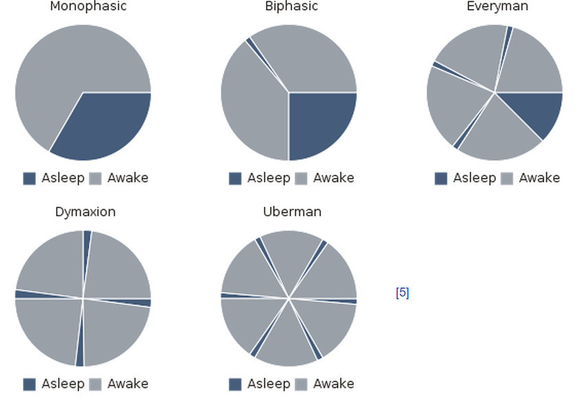
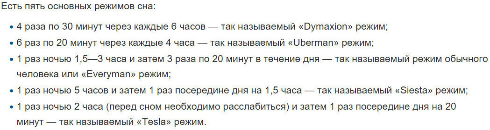

# Чем полезен полифазный сон?

Большинство из нас отдает предпочтение так называемому монофазному сну. Но часто мы вынуждены сокращать время для такого сна и спим по 5-7 часов в сутки, а то и меньше. Многие находят выход в сне другого типа — полифазном. Что это такое и чем он может быть полезен?

  

## Спать помалу, но часто

Очень часто мы мечтаем о том, чтобы в сутках было больше 24 часов -- столько дел! И мы сокращаем наш сон, а потом чувствуем усталость. Но есть выход - полифазный сон. На сегодняшнем примере рассмотрим режим под названием «**Uberman**»

Суть полифазного сна в том, что человек должен спать через равные промежутки времени, каждый из которых не должен превышать 20-30 минут. Тогда общее количество сна, которого вам хватит для восстановления организма сократится до 3 часов.Но это же более, чем странно, спросите вы? Слишком все идеально.Активно практикующие на себе полифазный сон люди, утверждают, что это действительно так, и они чувствуют себя прекрасно и даже лучше, чем при сне монофазном. Только главное здесь соблюдать те самые равные временные промежутки. Один такой промежуток не должен превышать 4-х часов. К примеру, вы выбрали отход ко сну в 00.00, 4.00, 12.00, 16.00, 20.00, а подъем соответственно в 00.30, 4.30, 12.30, 16.30, 20.30. Вы сами можете составить свое расписание, которое вам подходит.Любой сон делится на фазы - попеременный быстрый и медленный сон. В процессе последнего организм восстанавливает энергию, которую он потратил во время бодрствования, а в процессе быстрого сна отдыхает непосредственно мозг. Разница также заключается в том, что при медленном сне разбудить человека значительно легче, так как мозг продолжает работать, а при быстром сне --- практически невозможно.Полифазный сон характеризуется тем, что в его системе ваш организм привыкает переходить к быстрому сну за относительно короткий срок, что сокращает то время, которое вы проводите в кровати.

## **Полифазный сон --- плюсы и минусы**

Привыкание к полифазному сну придет через 7-10 дней после начала соблюдения расписания. В первое время будет немного трудно, но вы справитесь. Впоследствии организм сам будет вам сообщать о том, что вам пора поспать. Засыпать и пробуждаться от быстрого сна вы будете легко и без особого усердия.Дело в том, что отказ человека от медленного сна не несет в себе никаких негативных последствий для организма. Это доказано многочисленными исследованиями в США. Поэтому полифазный сон можно практиковать довольно длительно, до 5 месяцев.Но у полифазного сна есть ряд негативных сторон, и они касаются не состояния здоровья, а вашего режима. К примеру, в период «привыкания» к полифазному сну, в течение 7-10 дней не нужно назначать каких-то важных встреч и дел, так как организм будет в процессе адаптации, и вам будет тяжело аккумулировать свои силы на что-то очень важное.Также не пугайтесь, если вы поменяете свои пристрастия в еде и будете потреблять ее чаще и в больших количествах. Это происходит из-за непривычного графика для организма и того, что бодрствуете вы теперь чаще.Самое сложное --- это составить свое расписание так, чтобы полифазный сон вписывался туда идеально. Для тех, кто работает дома, --- полифазный сон просто идеален, так как процесс привыкания будет проистекать легко и впоследствии с ним у вас не будет проблем. Для тех же, кто работает в офисе на период адаптации к полифазному сну лучше воспользоваться отпуском, а потом вы уже привыкнете засыпать в любой обстановке. Полифазный сон обязывает вас быть пунктуальными и ответственными, если вы действительно решились на смену режима подойдите к этому процессу осмысленно и выполняйте все рекомендации. Над организмом нельзя издеваться, и если вы решили, что с полифазным сном вам будет значительно легче справляться с делами, то возможно пришла пора попробовать. 💤💤💤

[Source](https://tjournal.ru/flood/14018-chem-polezen-polifaznyy-son)
