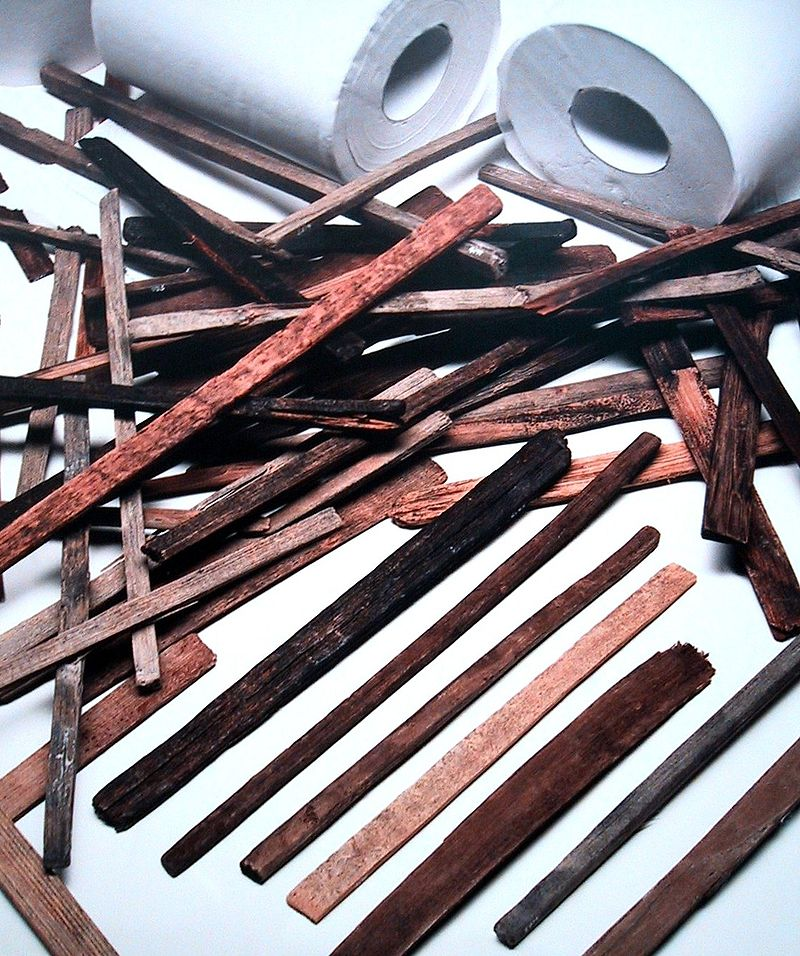
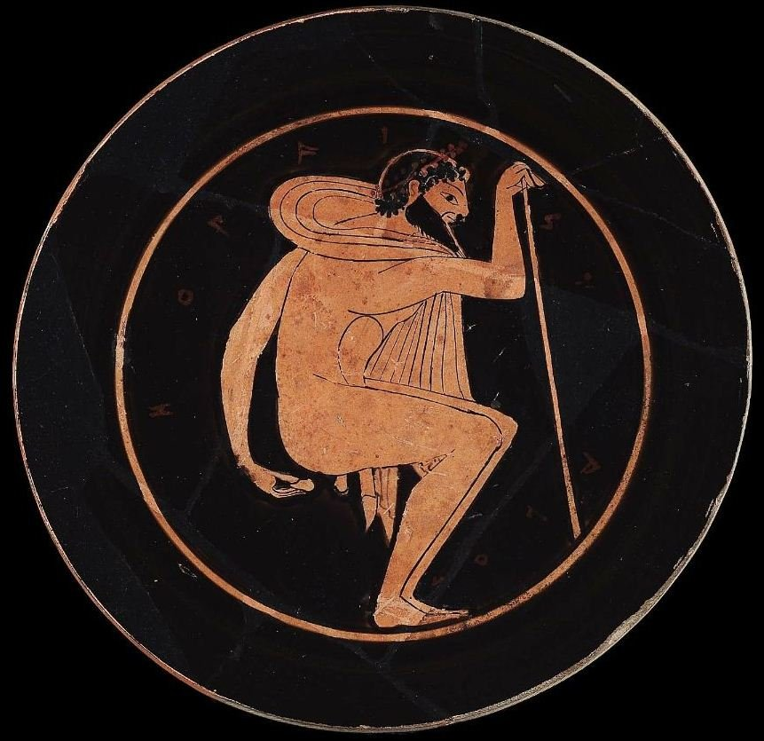

Утраченное искусство чистой задницы
===================================

Впервые подобие отвращения к собственным экскрементам у человека появляется в 3-4 года вместе со стыдом. Почему вместе? Потому что в указанном возрасте человек начинает осознавать себя не только существом отдельным, но и социальным. А у стыда, как и у отвращения, социально-психологические корни. Человек западного мира в целом не лучшим образом относится к производным плохо контролируемого физиологического процесса (мокроте, сперме, экскрементам и прочим прелестям). Истории этого отношения не одна сотня лет. Можно было бы сказать, что это естественно, однако этнографические исследования не торопятся подтверждать подобную позицию. Понятие естественности у различных племен и народов разное.

Отвратительные мужики давно обратили внимание на раскол в обществе. Вне зависимости от любых других признаков, всех людей на планете можно разделить на тех, кто моет задницу после дефекации, и тех, кто не делает этого, ограничиваясь использованием туалетной бумаги. Признаки этого раскола повсюду. Каждый раз, когда в мерзкой мужской компании поднимается эта тема, происходит примерно [следующий диалог](https://pikabu.ru/story/myit_ili_ne_myit_zadnitsu_4164234): «--- Ты что, моешь задницу? --- А ты что, не моешь задницу?».

Причин удивленно смеяться достаточно у обеих сторон: одни хохочут оттого, что их оппоненты касаются руками ануса и остатков собственного кала; другие ржут над вражескими грязными трусами, слипшейся интимной растительностью и другими плюсами гигиенической неприкосновенности инакомыслящих. Мы провели опросы среди подписчиков в социальных сетях и вынуждены поделиться [неутешительной статистикой](https://vk.com/disgusting_men?w=wall-25951501_583762): значительная часть ответивших (около 70%), встав с горшка, ограничивается использованием туалетной бумаги, натягивает штаны и идет дальше по делам. Согласно социологическим исследованиям, проведенным нами в течение нескольких лет, мытье задницы у этих людей является одной из частей более комплексного процесса: моют в душе перед сном вместе с остальными частями тела. Оставив за скобками ситуации, когда выбора просто нет (офисный, вокзальный, ресторанный туалеты), мы выяснили, что массово принято мыть зад в конце дня, чтобы не вставать два раза.

Мы решили углубиться в суть темы и выяснить, как возникла культура мытья зоны бикини после каждого присеста, а также попробовать найти оправдание тем, кто все еще [размазывает по стеночкам](https://tema.livejournal.com/1110500.html).

Искусство чистой задницы
------------------------

Японские палочки для подтирания. Не путать с палочками для еды.

Французский антрополог Филипп Шарле в своем труде [Toilet Hygiene in the Classical Era](http://www.scientificamerican.com/article/toilet-tissue-anthropologists-uncover-all-the-ways-weve-wiped/) рассказывает, кто, как и с какими последствиями следил за гигиеной в былые времена.

Гигиенический инвентарь зависит от множества факторов, в том числе, культуры и климата. Неудивительно, что жители пустынь не особо жаждут разбазаривать воду, а люди из лесов с радостью тянутся за лопухом. «Чистка ануса могла осуществляться различными способами в соответствии с местными обычаями и климатом: с использованием воды, листьев, травы, камней, кукурузных початков, меха животных, палок, снега, ракушек, и, наконец, просто голых рук».

Так, греки использовали камешки и глиняные шарики, которые археологи поначалу приняли за фишки для какой-то игры. Эллины не могли просто так совать в прямую кишку керамику и потому подходили к процессу творчески: писали на них имена своих врагов. Хочешь узнать, кого не любит грек --- посмотри на то, чем он подтирается.

Древние римляне подходили к вопросу еще жестче и прямолинейнее, пользуясь специальной палкой. Это было весьма неприятно, но зато наверняка способствовало знаменитой римской выправке и осанке. Впоследствии античная цивилизация перешла на классическое подмывание, и стало как-то попроще. Греки и римляне более позднего периода использовали подсоленную или разбавленную уксусом воду --- для лучшего обеззараживающего эффекта.

Арабы, а вслед за ними и многие мусульманские народы, которые сейчас славятся тем, что также подмываются, изначально использовали то, чем их снабдила пустыня --- песком и сухими камнями. Неудивительно, что однажды им захотелось бросить все и захватить иные страны, в которых не нужно орать от боли каждый раз после дефекации. Привычку подмываться они, судя по всему, переняли у угасающего античного мира, также как науки и греческую философию. Так что в плане подтирания их можно назвать органическими наследниками античной цивилизации, в отличие от европейцев.

В Средние века и Новое время западный мир делился по классовому принципу не только во внешней жизни, но и в уборных. Чернь соблюдала гигиену с помощью травы, колосьев, лопухов и вообще всего, что попадалось под руку. Уважаемые же господа использовали влажные полотенца, которыми аккуратно вытирали свои дворянские задницы. Франсуа Рабле в своем романе [«Гаргантюа и Пантагрюэль»](https://ru.wikipedia.org/wiki/%D0%93%D0%B0%D1%80%D0%B3%D0%B0%D0%BD%D1%82%D1%8E%D0%B0_%D0%B8_%D0%9F%D0%B0%D0%BD%D1%82%D0%B0%D0%B3%D1%80%D1%8E%D1%8D%D0%BB%D1%8C) весьма фривольно рассуждает о том, что лучше и приятнее всего подтираться гусенком, но такое себе сможет позволить далеко не каждый господин.

Генрих VIII наверняка гордился самой чистой задницей в Британии.

Британский король Генрих VIII ни разу в жизни не обременял себя подтиранием --- за него это делал специальный слуга. Причем ассистент был из высокопоставленных господ благородного происхождения. Единственным занятием слуги была чистка жирных окороков его величества, при этом он мог занимать министерскую должность. Монарх всегда был готов выслушать мнение того, кому доверял так беззаветно.

С изобретением китайцами туалетной бумаги и ее распространением в Европе, западная публика, сначала из желания следовать модным веяниям, а затем просто по привычке взяла эту технологию в оборот. Примерно с XVI века в этом обычае ничего не изменилось.

Представители западной цивилизации в массе продолжают использовать бумагу благодаря оперативности процесса, а тщательное мытье заднего прохода считается прерогативой народов востока. Хотя не имеет никакого значения, кто вы и откуда; чистая задница --- это чистая задница, а нелепая поза, в которой можно поймать человека, моющего свой зад, остается за закрытыми дверями уборной, и нечего тут фантазировать. В конце дня мытая задница будет пахнуть мылом, а вытертая --- дерьмом. Как и вся одежда, которая ее коснулась. Но есть, конечно, уважительные причины.

3 обстоятельства, которые дают право не мыть задницу
----------------------------------------------------

### *Ты живешь в XII веке*

*и скачешь верхом в тяжелом панцирном обмундировании*

Тяжелые доспехи, которые можно быстро примерить и сложить обратно в инвентарь, существуют только в видеоиграх. Средневековым рыцарям требовалось около часа, чтобы облачиться в полный панцирь, который защищает туловище и конечности. Процесс требовал участия помощника-оруженосца, который затем подсаживал лишенного былой мобильности смельчака на коня. Очевидно, что во время военного похода, когда рыцари были сутками закованы в доспехи, не представлялось возможным самостоятельно спешиться, забежать за угол, спустить штаны и с облегчением присесть.

### ***Ты космонавт***

Сотрудники Междунароной космической станции следят за собой в особых условиях: в невесомости невозможны ни душ, ни биде, ни просто раковина, возле которой можно встать и хорошенько намылиться. Космонавты используют контейнеры с водой и мылом, которые можно использовать как в комплекте с пористым полотенцем, так и просто в дуэте, если есть время для обстоятельного очищения.

Во времена первых космических полетов, которые были краткосрочными и предполагали, что астронавты в течение всего вылета находятся в скафандрах, и вовсе использовались специальные трусы со сменными впитывающими прокладками.

### *Ты машинист башенного строительного крана*

Огромный кран, в кабине которого машинист проводит до 8 часов в сутки, не оснащен туалетом, и если пилота приспичит, ему придется сначала долго спускаться вниз, а потом долго подниматься наверх. А если кишечный сигнал прозвучал в разгаре работ, то выбора нет: ведро или какая-нибудь заготовленная банка в помощь. Естественно, никакого водопровода в кабине тоже нет.

Мы летаем в космос, стоим на пороге сверхтехнологического будущего, разрабатываем искусственный интеллект и ищем разумную жизнь во Вселенной. И при этом человечество упорно продолжает шкрябать анус сушеной древесной пульпой, боясь подмыться, словно это Важная Традиция и едва ли не заповедь. Что если космические разумные виды не летят к нам, потому что брезгливо смотрят на наши немытые задницы в телескопы?

Текст: Владимир Бровин, Петр Сальников, Александр Алов
